# WorkbenchFX
[](https://travis-ci.com/FHNW-IP5-IP6/WorkbenchFX)

**The one and only library to build large JavaFX Applications!**

 

# Table of Contents
- [What is WorkbenchFX?](#what-is-workbenchfx)
- [Advantages](#advantages)
- [Main Components](#main-components)
- [Documentation](#documentation)
- [Basic Structure](#basic-structure)
  - [Workbench Concept](#workbench-concept)
  - [Module Lifecycle](#module-lifecycle)
- [Demos](#demos)
- [Getting Started](#getting-started)
  - [Extending the `WorkbenchModule`](#extending-the-workbenchmodule)
  - [Creating the `Workbench`](#creating-the-workbench)
  - [Optionals](#optionals)
    - [`WorkbenchBuilder`](#workbenchbuilder)
    - [`Workbench`](#workbench)
    - [`WorkbenchModule`](#workbenchmodule)
- [Using the Components](#using-the-components)
  - [ToolbarItem](#toolbaritem)
  - [Dialog](#dialog)
    - [Predefined Dialogs](#predefined-dialogs)
    - [Custom Dialog](#custom-dialog)
  - [Prevent module from closing](#prevent-module-from-closing)
  - [Drawer](#drawer)
  - [Custom Overlay](#custom-overlay)
- [Restyling](#restyling)
  - [Basic Styling](#basic-styling)
    - [Changing Colors](#changing-colors)
    - [Setting a Logo](#setting-a-logo)
  - [Advanced Styling](#advanced-styling)
- [Team](#team)

# What is WorkbenchFX?
TODO: description

# Advantages
- Less error-prone
- Less code needed
- Easy to learn
- Easy to understand
- Easy to use, especially for developers which have not much experience in working with JavaFX
- A well designed, adaptable UI, inspired by the material design standards
- Multiple, independent `Workbench modules`, displayed in Tabs combine into one great application
- The `jdk8` branch works well with [JPRO](https://www.jpro.one/)
- FXML & [Scene Builder](https://gluonhq.com/products/scene-builder/) support

# Main Components
The most important components are noted in the picture and the corresponding table below:

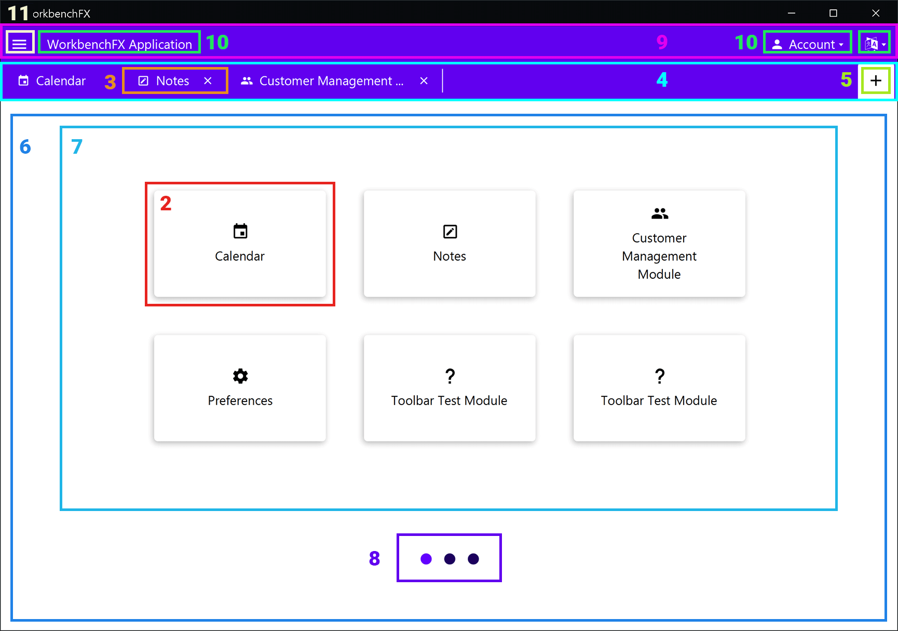

Nr. | Component           | Description
--- | ------------------- | -----------
 _  | `WorkbenchModule`   | The complete workbench application consists of one or multiple modules. It contains a title, an icon and the content to be displayed in the `Workbench`
 2  | `Tile`              | For each `WorkbenchModule` a `Tile` will be created. Clicking on the `Tile` opens the corresponding module
 3  | `Tab`               | A `Tab` will be displayed for each open module. Clicking on a `Tab` opens and shows the corresponding module. Pressing the `x` button closes the module
 4  | `TabBar`            | The upper section of the window, where the `Tab`s of the current open modules are displayed. On the right end of the bar, the `Add button` is displayed
 5  | `Add button`        | The button used to open a new module. It opens an overview of all available modules
 6  | `AddModulePage`     | Stores all the `Page`s on which the `Tile`s are displayed
 7  | `Page`              | When more modules are loaded than defined in the `modulesPerPage()` attribute, the `Workbench` creates multiple `Page`s on which the `Tile`s are displayed
 8  | `Pagination dots`   | Are only displayed when having multiple `Page`s and can be used for navigating through them
 9  | `Toolbar`           | It contains `ToolbarItem`s. If the bar does not contain any items, the `Toolbar` will be hidden automatically
10  | `ToolbarItem`       | Depending on the defined attributes, the item behaves like a JavaFX `Label`, `Button` or `MenuButton`
11  | `Menu button`       | It opens the `NavigationDrawer`. The position of the button varies depending on the amount of items in the `Toolbar` and the `NavigationDrawer`. If the `NavigationDrawer` does not contain any items, the button will not be displayed at all. If any items are in the `Toolbar`, it will be displayed on the left side of the `Toolbar`, otherwise on the left side of the `TabBar`

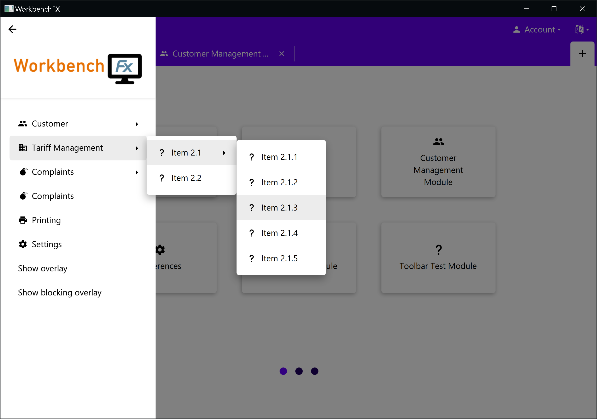

Nr. | Component           | Description
--- | ------------------- | -----------
12  | `NavigationDrawer`  | It displays a logo which can be set in the stylesheet (described in chapter [Setting a Logo](#setting-a-logo)) and the defined `MenuItems`. The default hover behavior over its items can be changed using the method call `setMenuHoverBehavior()` on `NavigationDrawer`. It can be closed by clicking on the `GlassPane` or by pressing the back arrow button
13  | `GlassPane`         | The `GlassPane` prevents click events on the components below and adds a scrim to the background. Unless a blocking (modal) overlay is being displayed, clicking on the `GlassPane` closes the overlay

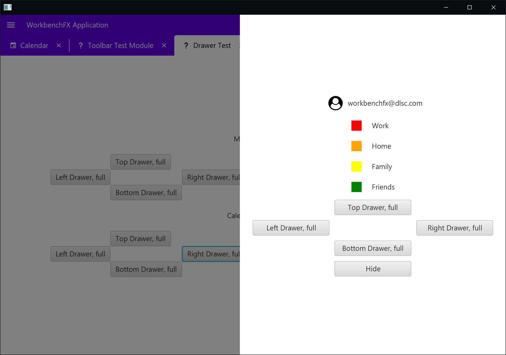

Nr. | Component           | Description
--- | ------------------- | -----------
14  | `Drawer`            | It is possible to use the `showDrawer()` call on the `Workbench` to show drawers with custom content. All four sides of the window are supported

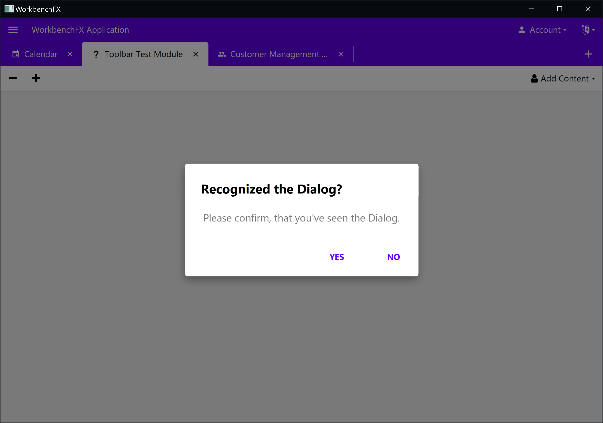

Nr. | Component           | Description
--- | ------------------- | -----------
15  | `DialogControl`     | Dialogs can be shown using a variety of predefined dialog types like `showInformationDialog()`, `showErrorDialog`, etc. Calling `showDialog(WorkbenchDialog)` on the `Workbench` shows a custom dialog

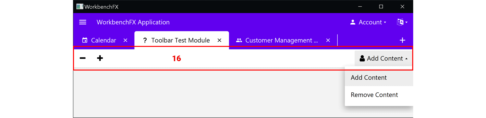

Nr. | Component           | Description
--- | ------------------- | -----------
16  | `Module toolbar`    | Calling `getToolbarControlsLeft()` or `getToolbarControlsRight()` in a `WorkbenchModule` gives access to their respective lists of `ToolbarItem`s. Adding to them will automatically show a module-specific toolbar

For further information about the components, refer to the `Javadoc`

# Documentation
This project uses the `asciidoctor` plugin to generate the necessary documentation. Run the following `maven` lifecycle:
```Maven
prepare-package -DskipTests
```
Afterwards, the documentation is located in the `target/generated-docs/` subdirectory.

# Basic Structure
## Workbench Concept
WorkbenchFX uses the builder pattern to create the `Workbench`, since it allows to use optional features in a flexible way.
The minimal usage requires only to specify the `WorkbenchModule` objects to be used in the `Workbench`.
Afterwards, optional features can be defined using their respective method call before calling `build()`.

For better illustration, the basic concept of creating a `Workbench` object is shown below:
```Java
Workbench workbench = 
    Workbench.builder( // Using the static method call
        new CustomWorkbenchModule() // class CustomWorkbenchModule extends WorkbenchModule
        ...
    )
    // .toolbarRight(...) // optional usage of additional features like navigationDrawer(), modulesPerPage(), etc.
    .build(); // The build call creates, initializes and returns the Workbench object
```

Note:
- The result of the `build()` call is a `Control` which can be set in a scene
- For use with FXML & [Scene Builder](https://gluonhq.com/products/scene-builder/), there is also a default constructor `new Workbench()`. However, in this case, modules and other optional features need to be defined separately afterwards

## Module Lifecycle
The abstract class `WorkbenchModule` contains four different lifecycle methods which can be overridden:

Method         | Description
-------------- | -----------
`init()`       | Gets called when the module is being opened from the overview for the first time
`activate()`   | Gets called whenever the currently displayed content is being switched to this module
`deactivate()` | Gets called whenever this module's currently displayed content is being switched to the content of another module
`destroy()`    | Gets called when this module is explicitly being closed by the user by clicking on the `x` symbol in the `Tab`

**When extending `WorkbenchModule`, it is only required to implement the `activate()` method.**
([Extending the `WorkbenchModule`](#extending-the-workbenchmodule))

Overriding all other lifecycle methods is optional and only needs to be done to perform additional actions in the lifecycle.
Besides a call to `super()`, no further workbench-related code is required when overriding a lifecycle method.

Note:
- For further information, refer to our documentation or the `Javadoc`
- The full documentation about the module lifecycle can be found in the documentation file `docs/index.adoc`, in the section *WorkbenchModule Lifecycle*

# Demos
We created several demos to visualize the capabilities of WorkbenchFX in the `workbenchfx-demo` folder:

File                | Description
------------------- | -----------
`StandardDemo.java` | Shows the simplest usage of WorkbenchFX with only three modules and no optional features used
`CustomDemo.java`   | A workbench application which uses all features, to demonstrate the full capability of WorkbenchFX
`FXMLDemo.java`     | A minimal example of how to use the `Workbench` with FXML & [Scene Builder](https://gluonhq.com/products/scene-builder/)

# Getting started
## Extending the `WorkbenchModule`
It is required to create a new class and extend `WorkbenchModule`, in order to create a custom module:

```Java
public class CustomModule extends WorkbenchModule {
  
}
```

It is then required to call the `super()` constructor and pass in a `String` as the name and either an `Image`, `FontAwesomeIcon` or `MaterialDesignIcon` as an icon for the module:

```Java
public CustomModule() {
  super("My first Workbench module", MaterialDesignIcon.THUMB_UP); // a name and an icon is required
}
```

Cheatsheets for using the icons are available at:
- [materialdesignicons.com](https://materialdesignicons.com/)
- [fontawesome.com](https://fontawesome.com/v4.7.0/)

Furthermore, overriding the `activate()` method is also required.
This lifecycle method will be called when clicking on the `Tile` to open the module (see [Module Lifecycle](#module-lifecycle)):

```Java
@Override
public Node activate() {
  return new Label("Hello World"); // return here the actual content to display
}
```

The minimal implementation of a custom `WorkbenchModule` finally looks like the code snippet below.
Returning a *Hello World Label* represents the view which will be displayed in the final application.
For further information, refer to the `Javadoc`.

```Java
public class CustomModule extends WorkbenchModule {
  public CustomModule() {
      super("My first Workbench module", MaterialDesignIcon.THUMB_UP); // A name and an icon is required
  }
  @Override
  public Node activate() {
      return new Label("Hello World"); // return here the actual content to display
  }
}
```

## Creating the `Workbench`
After extending the `WorkbenchModule`, the `Workbench` can be created.
To do this, access the `WorkbenchBuilder` by calling `Workbench.builder()`, passing in the previously created module as an object and build the `Workbench` by calling the `build()` method:

```Java
// Creating the Workbench
Workbench customWorkbench = Workbench.builder( // Getting a WorkbenchBuilder
    new CustomModule()                         // Adding the CustomModule
).build();                                     // Building the Workbench
```

For the *final application*, it can then be used in a `Scene` as follows:

```Java
public class CustomDemo extends Application {
  public static void main(String[] args) {
    launch(args);
  }

  @Override
  public void start(Stage primaryStage) {
    
    Workbench customWorkbench = Workbench.builder(
        new CustomModule()
    ).build();
    
    Scene myScene = new Scene(customWorkbench);
    primaryStage.setScene(myScene);
    primaryStage.setWidth(700);
    primaryStage.setHeight(450);
    primaryStage.show();
  }
}
```

This code snippet results in the following application:


The default implementation comes with a clickable `Tile` to open the module.
Opening the module, creates a `Tab` with the defined icon and text.
The content returned in the `activate()` method is displayed in the center.
By clicking on the `+` button, you can get back to the `AddModulePage`.
Closing the opened module is achieved through clicking on the close button in the `Tab`.

## Optionals
### `WorkbenchBuilder`
These optional method calls are called after adding the custom modules to the builder:

```Java
Workbench workbench = Workbench.builder(...)
.modulesPerPage(6) // call the optional methods
.build();
```

The following methods are optionally available to further configure the `Workbench`:

Method in WorkbenchBuilder | Description
-------------------------- | -----------
`modulesPerPage()`         | Defines the amount of `Tile`s that should be shown per `Page` in `AddModulePage`
`navigationDrawerItems()`  | Allows to add `MenuItem`s which are then displayed in the `NavigationDrawer`.
`toolbarLeft()`            | Allows to add `ToolbarItem`s on the left side of the toolbar on top of the `Tab`s
`toolbarRight()`           | Allows to add `ToolbarItem`s on the right side of the toolbar on top of the `Tab`s

When the default layout of `Page`, `Tab`, `Tile` or `NavigationDrawer` don't fulfill the desired requirements, it is possible to replace them:

Method in WorkbenchBuilder | Description
-------------------------- | -----------
`navigationDrawer()`       | Allows setting a custom implementation of the `NavigationDrawer` control, which will then be used
`pageFactory()`            | Requires a `Callback` function which takes a `Workbench` and then returns a custom implementation of a `Page` control
`tabFactory()`             | Requires a `Callback` function which takes a `Workbench` and then returns a custom implementation of a `Tab` control
`tileFactory()`            | Requires a `Callback` function which takes a `Workbench` and then returns a custom implementation of a `Tile` control

### `Workbench`
After the `build()` call on `WorkbenchBuilder`, the `Workbench` is created.
The following useful calls might be of interest:

Method in Workbench          | Description
---------------------------- | -----------
`getNavigationDrawer()`      | Returns the `NavigationDrawer`
`getNavigationDrawerItems()` | Returns the `ObservableList` of the drawer's `ToolbarItem`s
`show...Dialog()`            | Shows a [predefined dialog](#predefined-dialogs)
`showDialog()`               | Shows a [custom dialog](#custom-dialog)
`showDrawer()`               | Shows a [custom drawer](#drawer)
`getToolbarControlsLeft()`   | Returns the list of items on the left of the `Toolbar`
`getToolbarControlsRight()`  | Returns the list of items on the right of the `Toolbar`
`showOverlay()`              | Shows a [custom overlay](#custom-overlay)

### `WorkbenchModule`
The `WorkbenchModule` also provides useful functionality.
It is possible to add `ToolbarItem`s to the toolbar of the module (just like in the workbench):

Method (WorkbenchModule)    | Description
--------------------------- | -----------
`getWorkbench()`            | In the `init()` call, the `Workbench` is stored in the module. Calling this enables to call methods on the `Workbench` within the `WorkbenchModule`.
`getToolbarControlsLeft()`  | Returns a list of `ToolbarItem`s. Adding items to the list will automatically create a toolbar between the tab bar and the module content and show the items on the left side
`getToolbarControlsRight()` | Returns a list of `ToolbarItem`s. Adding items to the list will automatically create a toolbar between the tab bar and the module content and show the items on the right side
`close()`                   | Will immediately close the module, without calling `destroy()` first (see [Module Lifecycle](#module-lifecycle))

# Using the Components
## ToolbarItem
The `ToolbarItem`s which can be set in the toolbars of either the workbench or the module are styled and behave differently based on their content.
If for example the item contains a `String` as text and a `MenuItem` it is automatically assumed that the styling and behavior of a `MenuButton` is needed.
If on the other hand only an `IconView` is defined, it is assumed, the behavior of a `Label` is desired.

Adding different attributes to the `ToolbarItem` results in different representations: 
They can also be seen in the `toolbar` of the `CustomDemo`

<table>
    <tr>
        <th>Syntax</th>
        <th>Representation</th>
    </tr>
    <tr>
        <td><pre lang="java">
// Label with text
ToolbarItem toolbarItem = new ToolbarItem("Hello World");</td>
        <td>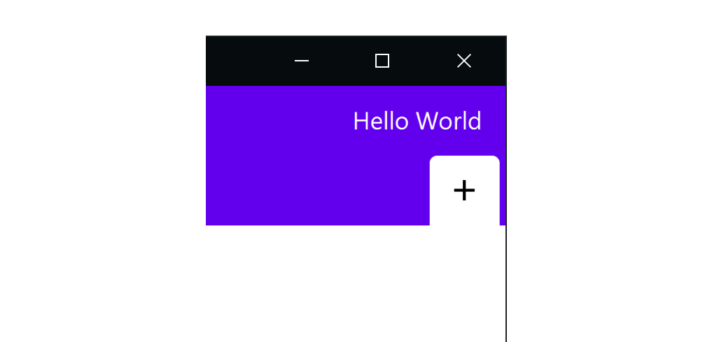</td>
    </tr>
    <tr>
        <td><pre lang="java">
// Label with graphic
ToolbarItem toolbarItem = new ToolbarItem(
    new MaterialDesignIconView(MaterialDesignIcon.THUMB_UP)
);</td>
        <td>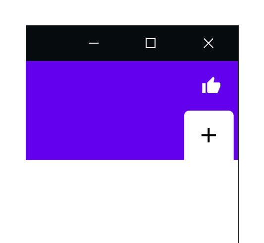</td>
    </tr>
    <tr>
        <td><pre lang="java">
// Label with text and graphic
ToolbarItem toolbarItem = new ToolbarItem(
    "Hello World",
    new MaterialDesignIconView(MaterialDesignIcon.THUMB_UP)
);</td>
        <td></td>
    </tr>
    <tr>
        <td><pre lang="java">
// Button with text
ToolbarItem toolbarItem = new ToolbarItem(
    "Hello World", event -> System.out.println("Hello World")
);</td>
        <td>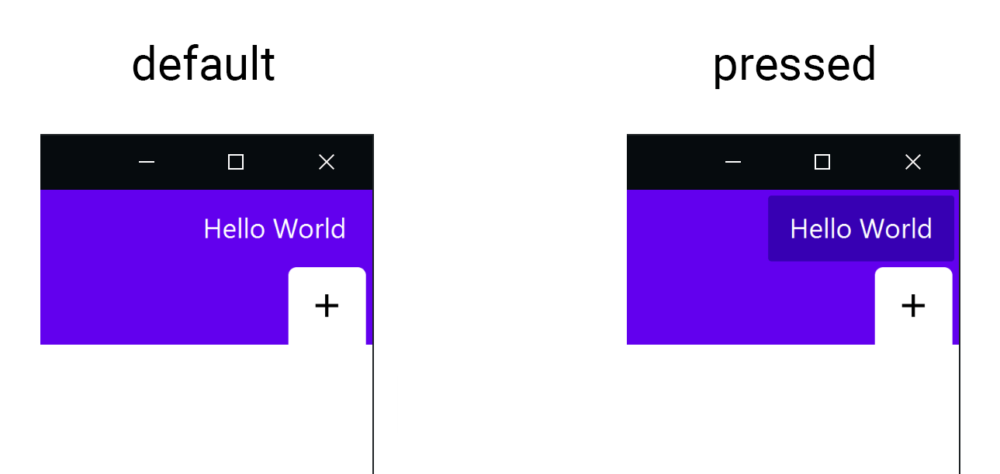</td>
    </tr>
    <tr>
        <td><pre lang="java">
// Button with graphic
ToolbarItem toolbarItem = new ToolbarItem(
    new MaterialDesignIconView(MaterialDesignIcon.THUMB_UP),
    event -> System.out.println("Hello World")
);</td>
        <td>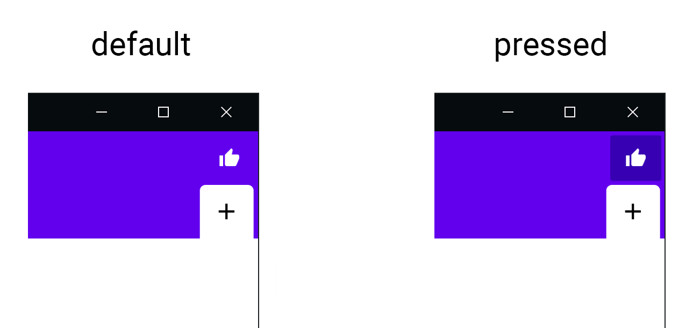</td>
    </tr>
    <tr>
        <td><pre lang="java">
// Button with text and graphic
ToolbarItem toolbarItem = new ToolbarItem(
    "Hello World",
    new MaterialDesignIconView(MaterialDesignIcon.THUMB_UP),
    event -> System.out.println("Hello World")
);</td>
        <td></td>
    </tr>
    <tr>
        <td><pre lang="java">
// MenuButton with text
ToolbarItem toolbarItem = new ToolbarItem(
    "Hello World",
    new MenuItem("Content 1"), new MenuItem("Content 2")
);</td>
        <td>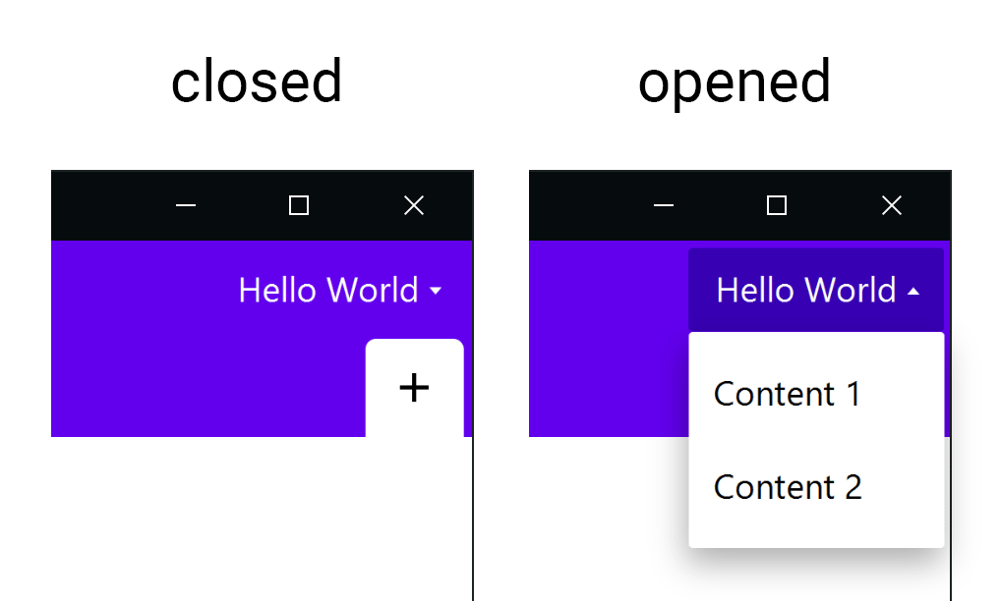</td>
    </tr>
    <tr>
        <td><pre lang="java">
// MenuButton with graphic
ToolbarItem toolbarItem = new ToolbarItem(
    new MaterialDesignIconView(MaterialDesignIcon.THUMB_UP),
    new MenuItem("Content 1"), new MenuItem("Content 2")
);</td>
        <td>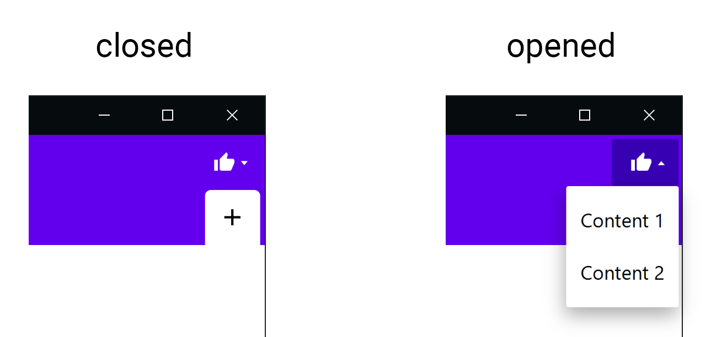</td>
    </tr>
    <tr>
        <td><pre lang="java">
// MenuButton with text and graphic
ToolbarItem toolbarItem = new ToolbarItem(
    "Hello World",
    new MaterialDesignIconView(MaterialDesignIcon.THUMB_UP),
    new MenuItem("Content 1"), new MenuItem("Content 2")
);</td>
        <td>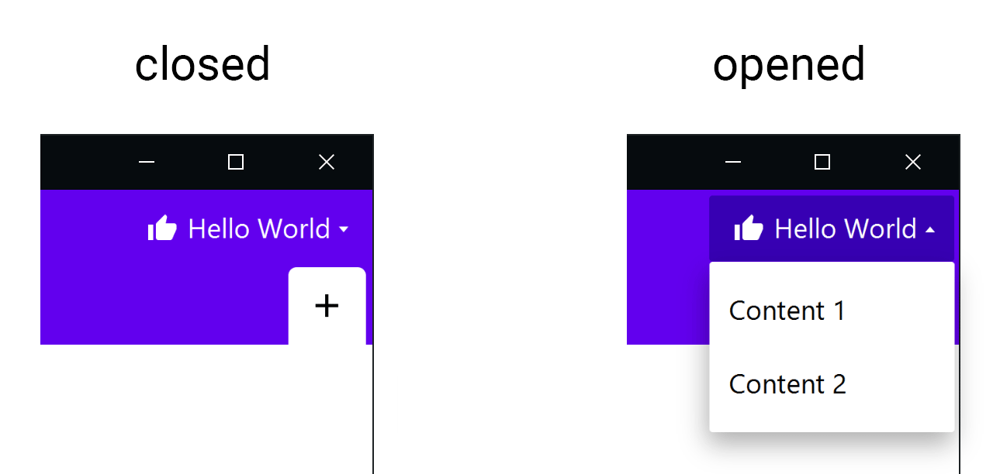</td>
    </tr>
    <tr>
    <tr>
        <td><pre lang="java">
// MenuButton with a MenuItem containing custom content
ToolbarItem toolbarItem = new ToolbarItem(
    "Account",
    new MaterialDesignIconView(MaterialDesignIcon.ACCOUNT),
    new MenuItem("",
        new HBox(
            new Label("Login: "),
            new TextField(),
            new Button("", new MaterialDesignIconView(
                MaterialDesignIcon.PLUS))
        )
    )
);</td>
        <td>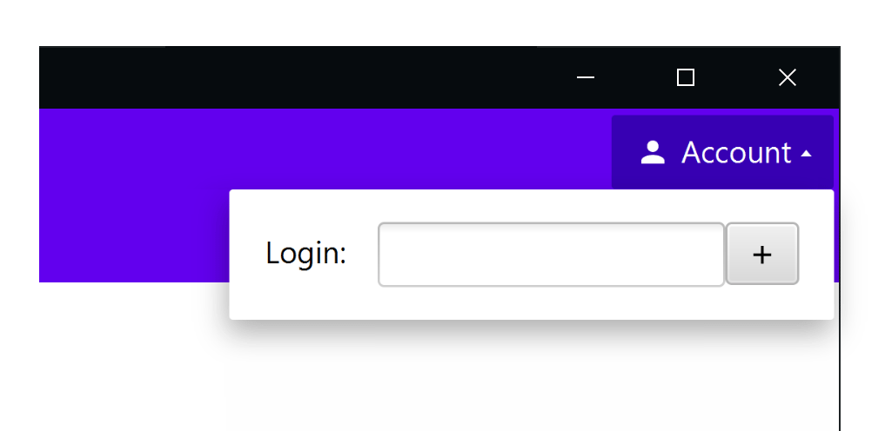</td>
    </tr>
    <tr>
</table>

## Dialog
A demo of the dialogs can be found in the `DialogTestModule` of the [Custom Demo](#demos) 

### Predefined Dialog Types
WorkbenchFX comes with a lot of predefined dialog types.
Using them is as simple as calling `(Workbench).show...Dialog()` with the desired dialog type.
After clicking on one of the `Button`s of a dialog, the corresponding `ButtonType` is returned as the result of the dialog.
Therefore it is required to define a `Consumer<ButtonType>` for every dialog to validate the answer.
A few examples on how to use them are listed below: 

```Java
// Precondition
Workbench workbench = Workbench.builder(...).build; // Creating the workbench
Button dialogBtn = new Button("Show Dialog"); // Assuming the button is used in a module
```

<table>
    <tr>
        <th>Syntax</th>
        <th>Outcome</th>
    </tr>
    <tr>
        <td><pre lang="java">
// Confirmation Dialog
dialogBtn.setOnAction(event ->
    workbench.showConfirmationDialog(
       "Continue without saving?",
       "Are you sure you want to continue without saving" +
       "your document?",
       buttonType -> { // Proceed and validate the result }
    )
);</td>
        <td></td>
    </tr>
    <tr>
        <td><pre lang="java">
// Error Dialog
dialogBtn.setOnAction(event ->
    workbench.showErrorDialog(
       "Button click failed!",
       "During the click of this button, something went" +
       "horribly wrong.",
       buttonType -> { // Proceed and validate the result }
    )
);</td>
        <td></td>
    </tr>
    <tr>
        <td><pre lang="java">
// Error Dialog with exception
dialogBtn = null; // Provokes an exception
try {
  dialogBtn.setOnAction(
     event -> System.out.println("Throws NPE!"));
} catch (NullPointerException exception) {
  workbench.showErrorDialog(
     "Button click failed!",
     "During the click of this button, something went" +
     "horribly wrong. Please forward the content below" +
     "to anyone but the WorkbenchFX developers to" +
     "track down the issue:",
     exception
     buttonType -> { // Proceed and validate the result }
  );
}</td>
        <td></td>
    </tr>
    <tr>
        <td><pre lang="java">
// Error Dialog with description
dialogBtn.setOnAction(event ->
    workbench.showErrorDialog(
       "Button click failed!",
       "During the click of this button, something went" +
       "horribly wrong.",
       "Details about this exception are not present."
       buttonType -> { // Proceed and validate the result }
    );
}</td>
        <td>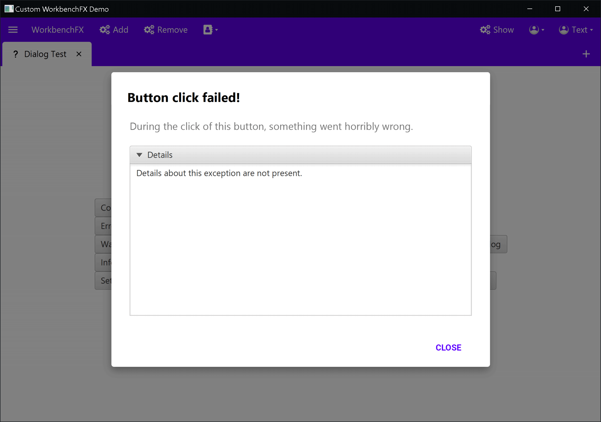</td>
    </tr>
    <tr>
        <td><pre lang="java">
// Warning Dialog
dialogBtn.setOnAction(event ->
    workbench.showWarningDialog(
       "Reset settings?",
       "This will reset your device to its default" +
       "factory settings.",
       buttonType -> { // Proceed and validate the result }
    )
);</td>
        <td></td>
    </tr>
    <tr>
        <td><pre lang="java">
// Information Dialog
dialogBtn.setOnAction(event ->
    workbench.showInformationDialog(
       "Just to let you know",
       "(This is an information dialog)",
       buttonType -> { // Proceed and validate the result }
    )
);</td>
        <td></td>
    </tr>
</table>

### Custom Dialog
Sometimes just using the default dialog types are not enough.
For such special cases, the `showDialog()` method can be used.
With a `WorkbenchDialog.builder()` a custom dialog can be created.
The builder provides some useful methods which can be used:

WorkbenchDialog.builder(*Parameters*) | Description
------------------------------------- | -----------
`String title`                        | Required and defines the `title` of the dialog
`String message`                      | Optional either a message or a content can be added. The `message` is located below the `title`
`Node content`                        | A `Node` as custom content
`Type type`                           | Defines one of the default dialog types like `error`, `information`, etc. The corresponding buttons will automatically be set
`ButtonType... buttonTypes`           | All the defined button types will be set (eg. `OK`, `CANCEL` and `APPLY` for a preferences dialog)

Note: 
- Defining a `content` will prevent any further definition of `messages` or `exceptions`

WorkbenchDialog.builder().*Parameters* | Description
-------------------------------------- | -----------
`blocking(boolean)`                    | Defines whether clicking on the `Glasspane` closes the dialog or not (eg. forcing a decision)
`onResult(Consumer<ButtonType>)`       | Clicking on a dialog, the clicked `ButtonType` is returned. On result proceeds the answer
`details(String)`                      | Adding details (@see the note on top)
`exception(Exception)`                 | Adding an `Exception` (@see the note on top)
`maximized(boolean)`                   | Defines whether the dialogs size should take the full screen or only as much as it fits the content
`showButtonsBar(boolean)`              | Defines whether the dialogs buttons should be shown or not
`onShown(EventHandler<Event>)`         | The `EventHandler` which is called when the dialog is showing
`onHidden(EventHandler<Event>)`        | The `EventHandler` which is called when the dialog is hidden
`dialogControl(DialogControl)`         | It is possible to set a custom `DialogControl`
`build()`                              | Builds the `WorkbenchDialog`

WorkbenchDialog                    | Description
---------------------------------- | -----------
`getButton(ButtonType buttonType)` | Returns an `Optional<Button>` of the dialog. Useful when accessing the buttons of the dialog is needed

Using the builder it is possible to write some interesting custom dialogs:

```Java
// Precondition
Workbench workbench = Workbench.builder(...).build; // Creating the workbench
Button dialogBtn = new Button("Show Dialog"); // Assuming the button is used in a module
```

<table>
    <tr>
        <th>Syntax</th>
        <th>Outcome</th>
    </tr>
    <tr>
        <td><pre lang="java">
// Dialog which requires input to proceed
// Create a CheckBox which will be set as content
CheckBox checkBox = 
  new CheckBox("I accept the Terms and Conditions");
dialogBtn.setOnAction(event -> {
  // Building the dialog with the CheckBox as content
  WorkbenchDialog dialog = WorkbenchDialog.builder(
  "Check the box to continue", checkBox, ButtonType.OK)
      .blocking(true)
      .build();
  // Bind the OK button to the CheckBox
  dialog.setOnShown(event1 -> {
    dialog.getButton(ButtonType.OK).ifPresent(
      button -> button.disableProperty().bind(
        checkBox.selectedProperty().not()));
  });
  getWorkbench().showDialog(dialog);
});</td>
        <td></td>
    </tr>
</table>

Other examples can be found in the `DialogTestModule` of the [Custom Demo](#demos) 

## Prevent module from closing
In some cases it is necessary to prevent a module from closing.
For example following dialog asks for saving before closing:

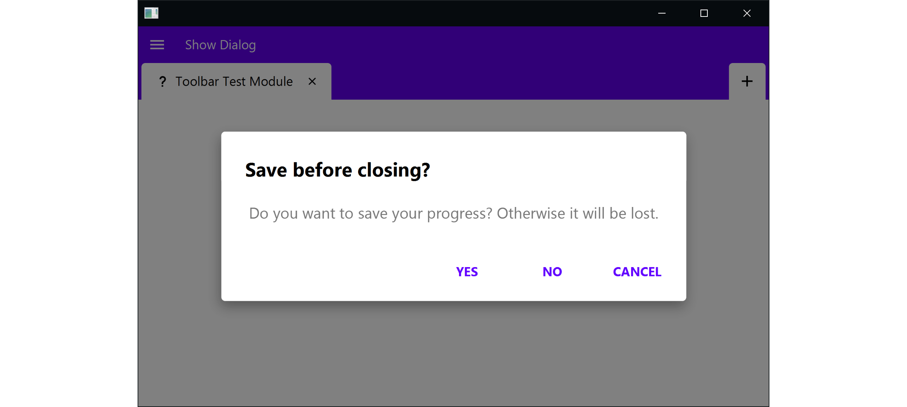

In the [Module Lifecycle](#module-lifecycle) it is stated, that the `destroy()` method will be called when closing the module.
The module will be closed as soon as the `destroy()` method returns `true`.
If someone wants to prevent the module from closing he has to return `false` and then close the module manually as soon as he is ready to.
This is done by calling the method `close()`.

The code snippet below results in the dialog displayed in the image on top:

```Java
@Override
public boolean destroy() {
  
  // Do some asynchronous task (in our case showing a dialog and waiting for input)
  getWorkbench().showDialog(WorkbenchDialog.builder(
      "Save before closing?",
      "Do you want to save your progress? Otherwise it will be lost.",
      ButtonType.YES, ButtonType.NO, ButtonType.CANCEL)
      .blocking(true)
      .onResult(buttonType -> {
        if (ButtonType.YES.equals(buttonType)) {
          // YES was pressed -> Proceed with saving
          ...
          close(); // At the end of saving, close the module 
        }
      })
      .build());
  
  return false; // return false, because we're closing manually
}
```

## Drawer
Using the `workbench` call `showDrawer()` one can define a custom drawer just like the `NavigationDrawer`.
There are two different possibilities to define a drawer: 

    workbench.showDrawer(
        Region drawer, // The drawer to be shown
        Sider side     // Defines from which side the drawer should come
    );

Calling this, the width of the drawer is calculated automatically and takes the width which fits best for the drawer content defined.
The other possibility comes into action when a specific width is desired:
    
    workbench.showDrawer(
        Region drawer, // The drawer to be shown
        Sider side     // Defines from which side the drawer should come
        int percentage // Defines how much of the screen should be covered
    );

The `percentage` can be defined in range `0` to `100` and represents the percentage of the window the drawer covers when showing.  

Examples of drawers can be found in the [Custom Demo](#demos)

## Custom Overlay
The foundation of [Dialogs](#dialog) and [Drawers](#drawer) are `Overlays`.
It is possible to define a custom one using the method `showOverlay()` in the `workbench`.
The defined overlay will be stacked on a `GlassPane`.

    workbench.showOverlay(
        Region overlay,  // The overlay to be shown
        boolean blocking // true, if the overlay should not be closed when clicking on the glasspane
    );
    
The overlay can essentially be any `Region` (for example a `Custom Control`).
As default, the defined content will be displayed in the top-left corner of the window.
If it is desired to center the content, the following call inside the overlay is needed: 

```Java
StackPane.setAlignment(this, Pos.CENTER); // This call is needed to center the overlay on screen
```

# Restyling
## Basic Styling
First of all:
`WorkbenchFX` does not interrupt with the styles of the modules.
This way each module can be styled independently and one does not have to worry about the workbench taking influence on the styling.

But it is possible to alter the styles of the workbench itself.
`WorkbenchFX` comes with an out of the box styling.
It is strongly inspired by the [material design standards](https://material.io/).

In the [CustomDemo.java](#demos) file a stylesheet is referenced:
      
```Java
workbench.getStylesheets().add(CustomDemo.class.getResource("customTheme.css").toExternalForm());
```

This way, the workbench styling can be altered.
In the `customTheme.css` file are some default colors referenced:

```css
* {
  -primary-color: #6200EE;
  -primary-variant-color: #3700b3;
  -secondary-color: #6300ff;
  -secondary-variant-color: #1e005f;
  -background-color: #FFFFFF;
  -surface-color: #FFFFFF;
  -error-color: #B00020;
  -on-primary-color: #FFFFFF;
  -on-secondary-color: #FFFFFF;
  -on-background-color: #000000;
  -on-surface-color: #000000;
  -on-error-color: #FFFFFF;
}

.logo {
  /* Reference to the applications logo */
  -fx-graphic: url("logo.png");
}
```

Their naming and the way they are used is directly taken from the [material design standards](https://material.io/design/color/the-color-system.html#color-theme-creation).
Changing those colors leads to a complete restyling of the application.
For example A `darkTheme.css` is also referenced in the demo:

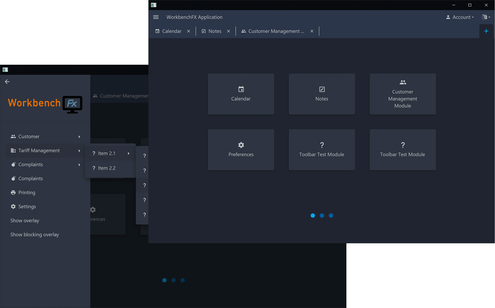

### Changing Colors

If someone would like to change the colors of the application, he creates a new css file `customTheme.css` and refers to it in the workbench:

```Java
customWorkbench.getStylesheets().add(CustomDemo.class.getResource("customTheme.css").toExternalForm());
``` 

In context the code looks like this:

```Java
public class CustomDemo extends Application {
  public static void main(String[] args) {
    launch(args);
  }

  @Override
  public void start(Stage primaryStage) {
    
    // Creating the Workbench
    Workbench customWorkbench = Workbench.builder( // Accessing the WorkbenchBuilder
        new CustomModule() // Adding the CustomModule
    ).build(); // Building the Workbench
    
    // Adding the stylesheet to the workbench to restyle it
    customWorkbench.getStylesheets().add(CustomDemo.class.getResource("customTheme.css").toExternalForm());
    
    Scene myScene = new Scene(customWorkbench);
    primaryStage.setScene(myScene);
    primaryStage.setWidth(700);
    primaryStage.setHeight(450);
    primaryStage.show();
  }
}
``` 

Changing the colors in the `css` file to something like this:

```css
* {
  -primary-color: #9db668;
  -primary-variant-color: #7f975f;
  -secondary-color: #9db668;
  -secondary-variant-color: #7f975f;
  -background-color: #FFFFFF;
  -surface-color: #FFFFFF;
  -error-color: #B00020;
  -on-primary-color: #FFFFFF;
  -on-secondary-color: #FFFFFF;
  -on-background-color: #747474;
  -on-surface-color: #747474;
  -on-error-color: #FFFFFF;
}
```

Leads to following design:

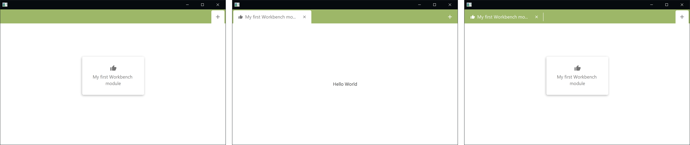

### Setting a Logo

In the upper section of the `Navigation drawer` is a section for a logo defined.
The logo is defined by refering to it in the custom stylesheet (how to create and reference is described in previous chapter).
An example implementation of the logo can be found in the `customTheme.css` of the [Custom Demo](#demos):

```css
.logo {
  /* Reference to the applications logo */
  -fx-graphic: url("logo.png");
}
```

Changing the logo can be easy done by adding an image with the fitting size in the sources folder and referring its name in the stylesheet:

```css
.logo {
  /* Reference to the applications logo */
  -fx-graphic: url("myCustomLogo.png"); /* Exchanging logo.png with another image. */
}
```

Note:
- `WorkbenchFX` does not resize the image. We suggest a maximal image height of 250px

## Advanced Styling
Sometimes just changing the colors is not enough.
Every component in the workbench has its own `class` or `id`.
This way, the components can be restyled if needed.

For example every generated `Tab` and `Tile` has its own unique `id`.
the naming convention for the `id` is set to:
- Prefix: `tab/tile` (depending on the component)
- body: the defined name of the module
  - with any special letters removed
  - all ' ' spaces replaced with '-' hyphens
  - uppercase letters converted to lowercase


    Setting the LOGGER level to debug will print each modules tab- and tile-ID as soon as they are set:
    - Set Tab-ID of '(MODULE NAME)' to: '(TAB ID)'
    - Set Tile-ID of '(MODULE NAME)' to: '(TILE ID)'

For further information we refer to the Javadoc `WorkbenchUtils.convertToId()`

`id` example:

    Module name:
        François' Module
        
    Results to:
        tab-franois-module // Tab-ID
        tile-franois-module // Tile-ID
        
    And a LOGGER output of:
        Set Tab-ID of 'François' Module' to: 'tab-franois-module'
        Set Tile-ID of 'François' Module' to: 'tile-franois-module'

Referring to the custom workbench in the chapter [Getting Started](#getting-started):

Assuming the `Tab` and `Tile` are needed to be restyled: Adding following code snippet to the `customTheme.css` 

```css
/* Styling the Tile */
#tile-my-first-workbench-module .tile-box {
  -fx-background-color: -primary-color !important; /* The background of the Tile */
}

#tile-my-first-workbench-module .tile-box .text, /* The icon and the text */
#tile-my-first-workbench-module .tile-box .glyph-icon {
  -fx-fill: -on-primary-color !important;
}

/* Styling the Tab */
#tab-my-first-workbench-module:selected {
  -fx-background-color: #747474 !important; /* The background of the Tab */
  -fx-background-radius: 5px 5px 0 0 !important;
}

#tab-my-first-workbench-module:selected .text, /* The icon and the text */
#tab-my-first-workbench-module:selected .glyph-icon {
  -fx-fill: #ffffff !important;
}

#tab-my-first-workbench-module:selected .shape {
  -fx-background-color: #ffffff !important; /* The close icon */
}
```

Leads to following styling:

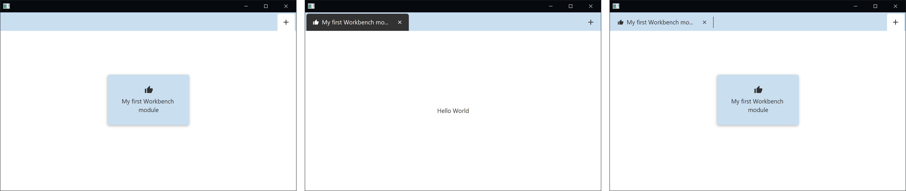

Note:
- The `color-variables` still can be used in the `customTheme.css` file
- Since the styling of the workbench is superior, the `!important` tag is required when restyling the workbench
- A tool like [ScenicView](http://fxexperience.com/scenic-view/) works well to determine the style classes

# Team
- Marco Sanfratello
  - marco.sanfratello@students.fhnw.ch
  - Skype: sanfratello.m@gmail.com 
  - GitHub: Genron

- François Martin
  - francois.martin@students.fhnw.ch 
  - Skype: francoisamimartin
  - GitHub: martinfrancois
  
- Dirk Lemmermann
  - dlemmermann@gmail.com
  - Skype: dlemmermann
  - GitHub: dlemmermann
  
- Dieter Holz
  - dieter.holz@fhnw.ch
  - Skype: dieter.holz.canoo.com
  - GitHub: DieterHolz
