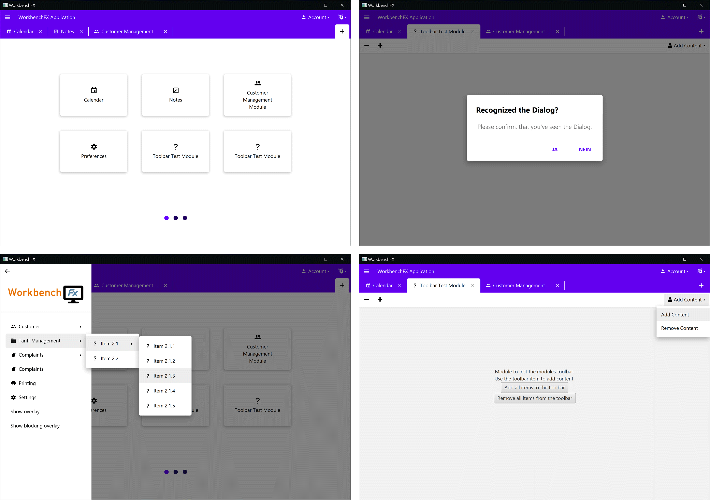

# WorkbenchFX
[](https://travis-ci.com/FHNW-IP5-IP6/WorkbenchFX)

**The one and only library to build large JavaFX Applications!**

 

# Table of Contents
- [What is WorkbenchFX?](#what-is-workbenchfx)
- [Advantages](#advantages)
- [Main Components](#main-components)
- [Documentation](#documentation)
- [Basic Structure](#basic-structure)
  - [Workbench Concept](#workbench-concept)
  - [Module Lifecycle](#module-lifecycle)
- [Demos](#demos)
- [Getting Started](#getting-started)
  - [Extending the `WorkbenchModule`](#extending-the-workbenchmodule)
  - [Creating the `Workbench`](#creating-the-workbench)
  - [Optionals](#optionals)
    - [`WorkbenchBuilder`](#workbenchbuilder)
    - [`Workbench`](#workbench)
    - [`WorkbenchModule`](#workbenchmodule)
- [Using the Components](#using-the-components)
  - [ToolbarItem](#toolbaritem)
  - [Dialog](#dialog)
  - [Prevent module from closing](#prevent-module-from-closing)
  - [Drawer](#drawer)
  - [Custom Overlay](#custom-overlay)
- [Restyling](#restyling)
- [Team](#team)

# What is WorkbenchFX?
TODO: description

# Advantages
- Less error-prone
- Less code needed
- Easy to learn
- Easy to understand
- Easy to use, especially for developers which have not much experience in working with JavaFX
- A well designed, adaptable UI, inspired by the material design standards
- Multiple, independent `Workbench modules`, displayed in Tabs combine into one great application
- The `jdk8` branch works well with `JPRO`
- `SceneBuilder` support

# Main Components
The most important components are noted in the picture and the corresponding table below:



Nr. | Component           | Description
--- | ------------------- | -----------
 _  | `Workbench module`  | The complete workbench application consists of multiple modules. It contains the title, an icon and the content to be displayed in the `Workbench`
 2  | `Tile`              | Using the `Workbench module`, a `Tile` will be created. It is basically a button which allows to open a module or switch to it, if it's already open.
 3  | `Tab`               | Together with the `Tile`, a `Tab` will be generated. It will be displayed in the `Tabbar` as long as the module is open. The `Tab` is used to navigate through the open modules and to close them
 4  | `Tabbar`            | The upper section of the window, where the `Tabs` of the current open modules are displayed. On the right end of the bar, the `Add button` is displayed
 5  | `Add button`        | The button used to open a new module. It opens an overview of all available modules.
 6  | `Pagination`        | Stores all the `Pages` on which the `Tiles` are displayed
 7  | `Page`              | When having more modules as are defined in the `modulesPerPage()` attribute, the `Workbench` creates multiple `Pages` on which the `Tiles` are displayed
 8  | `Pagination dots`   | are only displayed when having multiple `Pages` and can be used for navigating through them
 9  | `Toolbar`           | It contains `Toolbar items`. If the bar does not contain any items, the `Toolbar` will be hidden automatically.
10  | `Toolbar item`      | Depending on the attributes defined, the item adapts the behaviour of either a JavaFX `Label`, `Button` or `MenuButton`
11  | `Menu button`       | It opens the `Navigation drawer`. The position of the button varies depending on the amount of items in the `Toolbar` and the `Navigation drawer`. If the `Navigation drawer` does not contain any items, the button will not be displayed at all. If any items are in the `Toolbar`, it will be displayed on the left side of the `Toolbar`, otherwise on the left side of the `Tabbar`
12  | `Navigation drawer` | It displays a logo which can be set in the stylesheet and the defined items. The default hover behaviour over its items can be adjusted using the method call `setMenuHoverBehavior()` on the drawer. It can be closed by clicking on the `Glass pane`
13  | `Glass pane`        | The `Glass pane` prevents click events on the components below. Clicking on the `Glass pane` often closes the showing `Drawer` or `Dialog` unless its `blocking` attribute prevents it from closing
14  | `Drawers`           | It is possible to use the optional `showDrawer()` call on the `Workbench` to create additional drawers with custom content. All four window sides are supported
15  | `Workbench dialog`  | When calling `showDialog()` on the `Workbench`, there is the possibility to create a custom dialog, or using a variety of predefined dialogs like `error-, confirmation-, information-dialog, etc.`
16  | `Module toolbar`    | Calling `getToolbarControlsLeft()` or `getToolbarControlsRight()` on a `Workbench module` gives access to its `Toolbar items`. Adding them will automatically generate a unique toolbar for it

For further information about the several components we refer to the `Javadoc`

# Documentation
This project uses the `asciidoctor` plugin to generate the necessary documentation. Run the following *maven* task:
```Maven
process-resources
```
Afterwards, you will find the documentation in the `target/generated-docs/` subdirectory.

# Basic Structure
## Workbench Concept
WorkbenchFX uses the builder pattern to create the application, since one can use plenty of optional features.
The minimal usage requires only the definition of a custom extension from the `WorkbenchModule`.
Afterwards one can define further functionality calling the equivalent methods.

For better illustration, the basic concept of creating a workbench application is shown below:
```Java
Workbench workbench = 
    Workbench.builder( // Using the static method call
        new CustomWorkbenchModule() // Extension of the WorkbenchModule
        ...
    )
    // .toolbarRight(...) // optional usage of additional features eg. navigationDrawer(), modulesPerPage(), etc.
    .build(); // The build call finishes and returns the workbench
```

Notes:
- The result of the `build()` call is a `Control` which can be set in a scene.
- It is also possible to use the default constructor `new Workbench()` and add the `WorkbenchModules` and features afterwards. But it is recommended to use the builder pattern, since it is much easier to create the `Workbench`. The default constructor comes in use when the API is used with `Scenebuilder`.

## Module Lifecycle
// Chapter about the module lifecycle

# Demos
We created several demos to visualize the capabilities of `WorkbenchFX` in the `workbench-fx-demo` folder:

File | Description
---- | -----------
`StandardDemo.java` | Shows the simplest usage of `WorkbenchFX` with only three modules and no optional features  
`CustomDemo.java` | A workbench application which uses all features, to demonstrate the full capability of `WorkbenchFX`
`FXMLDemo.java` | A proof of concept, if the API also works with `SceneBuilder` and a `FXML` file

# Getting started
## Extending the `WorkbenchModule`
An extension of the abstract class `WorkbenchModule` is required in order to create an application:

```Java
public class CustomModule extends WorkbenchModule {
  
}
```

It is then required to call the `super()` constructor and hand over a `String` as name and either an `Image`, `FontawesomeIcon` or `MaterialDesignIcon` as icon for the module:

```Java
public CustomModule() {
  super("My first Workbench module", MaterialDesignIcon.THUMB_UP); // A name and an icon is required
}
```

Cheatsheets for using the icons are available at:
- [materialdesignicons.com](https://materialdesignicons.com/)
- [fontawesome.com](https://fontawesome.com/v4.7.0/)


Furthermore, overriding the `activate()` method is also required.
This method will be called when clicking on the `Tile` to open the module:

```Java
@Override
public Node activate() {
  return new Label("Hello World"); // return here your actual content to display
}
```

The minimal implementation of a custom `WorkbenchModule` finally looks like the code snippet below.
For further information we refer to the `Javadoc`.

```Java
public class CustomModule extends WorkbenchModule {
  public CustomModule() {
      super("My first Workbench module", MaterialDesignIcon.THUMB_UP); // A name and an icon is required
  }
  @Override
  public Node activate() {
      return new Label("Hello World"); // return here your actual content to display
  }
}
```

## Creating the `Workbench`
After extending the `WorkbenchModule`, the application can be created.
To do this, one can access the `WorkbenchBuilder` by calling `Workbench.builder()`, setting the previously written module and build the `Workbench` by calling the `build()` method:

```Java
// Creating the Workbench
Workbench customWorkbench = Workbench.builder( // Accessing the WorkbenchBuilder
    new CustomModule() // Adding the CustomModule
).build(); // Building the Workbench
```

It then can be set into a scene:

```Java
public class CustomDemo extends Application {
  public static void main(String[] args) {
    launch(args);
  }

  @Override
  public void start(Stage primaryStage) {
    
    // Creating the Workbench
    Workbench customWorkbench = Workbench.builder( // Accessing the WorkbenchBuilder
        new CustomModule() // Adding the CustomModule
    ).build(); // Building the Workbench
    
    Scene myScene = new Scene(customWorkbench);
    primaryStage.setScene(myScene);
    primaryStage.setWidth(700);
    primaryStage.setHeight(450);
    primaryStage.show();
  }
}
```

This code snippet results to the following application:


The default implementation comes with a clickable `Tile` to open the module.
Opening the module, creates a `Tab` with the defined Icon and text and the content returned in the activate() method is displayed in the center.
By clicking on the `+` button, one gets back to the `AddModulePage`.
Closing the opened module is achieved through clicking on the close button in the `Tab`.

## Optionals
### `WorkbenchBuilder`
These optionals are called after adding the custom modules to the builder:

```Java
Workbench workbench = Workbench.builder(...)
.modulesPerPage(6) // call the optionals
.build();
```

The following parameters are optionally available to further configure the application:

Method (WorkbenchBuilder) | Description
------------------ | -----------
`modulesPerPage()` | Define the amount of `Tiles` which are displayed at the `AddModulePage`
`navigationDrawerItems()` | Allows setting multiple `MenuItems` which are then displayed in the `NavigationDrawer`. The button to open and close the drawer appears alway in the top-left corner
`toolbarLeft()` | Allows setting multiple `ToolbarItems` on the left side of the toolbar on top of the `Tabs`
`toolbarRight()` | Allows setting multiple `ToolbarItems` on the right side of the toolbar on top of the `Tabs`

When the default layout of `Page`, `Tab`, `Tile` or `NavigationDrawer` doesn't fulfill the desired requirements, it is possible to replace them:

Method (WorkbenchBuilder) | Description
------------------ | -----------
`navigationDrawer()` | Allows setting a custom implementation of the `NavigationDrawer` control, which will then be used
`pageFactory()` | Requires a `Callback` function which takes a `Workbench` and then returns a custom implementation of a `Page` control
`tabFactory()` | Requires a `Callback` function which takes a `Workbench` and then returns a custom implementation of a `Tab` control
`tileFactory()` | Requires a `Callback` function which takes a `Workbench` and then returns a custom implementation of a `Tile` control

### `Workbench`
After the `build()` call on the builder, the `Workbench` is created.
Following useful calls might be interesting:

Method (Workbench) | Description
------------------ | -----------
`getNavigationDrawer()`      | Returns the `Navigation drawer`
`getNavigationDrawerItems()` | Returns the `ObservableList` of the drawers `ToolbarItems`
`showDialog()`               | Shows a custom dialog
`showDrawer()`               | Shows a custom drawer
`getToolbarControlsLeft()`   | Grants access to the items on the left of the `Toolbar`
`getToolbarControlsRight()`  | Grants access to the items on the right of the `Toolbar`

### `WorkbenchModule`
The `WorkbenchModule` also provides optional functionality.
It is possible to add `ToolbarItems` to the toolbar of the module (just like in the workbench):

Method (WorkbenchModule)    | Description
--------------------------- | -----------
`getToolbarControlsLeft()`  | Calling this method returns an `ObservableList` of `ToolbarItems`. Adding items to the list will automatically create a toolbar between the `Tab` and the module content and adds the items on the left side
`getToolbarControlsRight()` | Calling this method returns an `ObservableList` of `ToolbarItems`. Adding items to the list will automatically create a toolbar between the `Tab` and the module content and adds the items on the right side
`close()`                   | Will immediately close the module, ignoring the module lifecycle

# Using the Components
## ToolbarItem
Definition and behaviour of TBI

<table>
    <tr>
        <th>Syntax</th>
        <th>Outcome</th>
    </tr>
    <tr>
        <td><pre lang="java">
// Label with text
        </td>
        <td></td>
    </tr>
    <tr>
        <td><pre lang="java">
// Label with graphic
        </td>
        <td></td>
    </tr>
    <tr>
        <td><pre lang="java">
// Label with text and graphic
        </td>
        <td></td>
    </tr>
    <tr>
        <td><pre lang="java">
// Button with text
        </td>
        <td></td>
    </tr>
    <tr>
        <td><pre lang="java">
// Button with graphic
        </td>
        <td></td>
    </tr>
    <tr>
        <td><pre lang="java">
// Button with text and graphic
        </td>
        <td></td>
    </tr>
    <tr>
        <td><pre lang="java">
// MenuButton with text
        </td>
        <td></td>
    </tr>
    <tr>
        <td><pre lang="java">
// MenuButton with graphic
        </td>
        <td></td>
    </tr>
    <tr>
        <td><pre lang="java">
// MenuButton with text and graphic
        </td>
        <td></td>
    </tr>
    <tr>
</table>


## Dialog
Definition and behaviour of Dialogs.
List of all default Dialogs

<table>
    <tr>
        <th>Syntax</th>
        <th>Outcome</th>
    </tr>
    <tr>
        <td><pre lang="java">
// Dialog
        </td>
        <td></td>
    </tr>
    <tr>
        <td><pre lang="java">
// Dialog
        </td>
        <td></td>
    </tr>
    <tr>
        <td><pre lang="java">
// Dialog
        </td>
        <td></td>
    </tr>
    <tr>
        <td><pre lang="java">
// Dialog
        </td>
        <td></td>
    </tr>
    <tr>
        <td><pre lang="java">
// Dialog
        </td>
        <td></td>
    </tr>
    <tr>
        <td><pre lang="java">
// Dialog
        </td>
        <td></td>
    </tr>
    <tr>
        <td><pre lang="java">
// Dialog
        </td>
        <td></td>
    </tr>
    <tr>
        <td><pre lang="java">
// Dialog
        </td>
        <td></td>
    </tr>
    <tr>
        <td><pre lang="java">
// Custom Dialog
        </td>
        <td></td>
    </tr>
    <tr>
</table>

## Prevent module from closing
// Chapter about using the Dialog to save and close

## Drawer
// Chapter about using the Drawers

## Custom Overlay
// Chapter about creating a custom overlay

# Restyling
// Chapter about using the stylesheet

# Team
- Marco Sanfratello
  - marco.sanfratello@students.fhnw.ch
  - Skype: sanfratello.m@gmail.com 
  - GitHub: Genron

- François Martin
  - francois.martin@students.fhnw.ch 
  - Skype: francoisamimartin
  - GitHub: martinfrancois
  
- Dirk Lemmermann
  - dlemmermann@gmail.com
  - Skype: dlemmermann
  - GitHub: dlemmermann
  
- Dieter Holz
  - dieter.holz@fhnw.ch
  - Skype: dieter.holz.canoo.com
  - GitHub: DieterHolz
