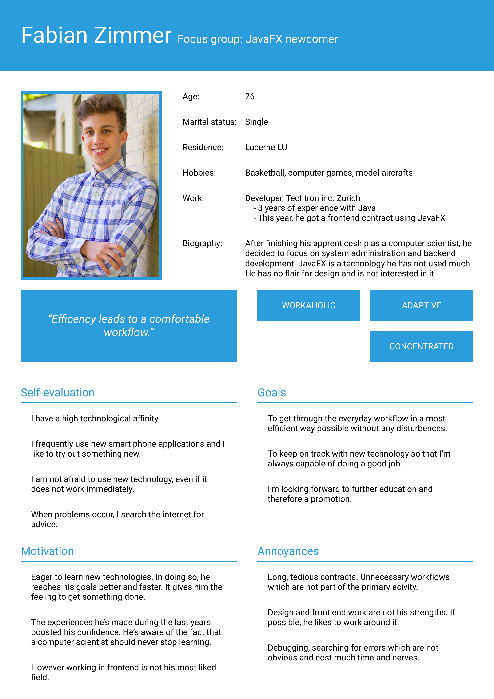
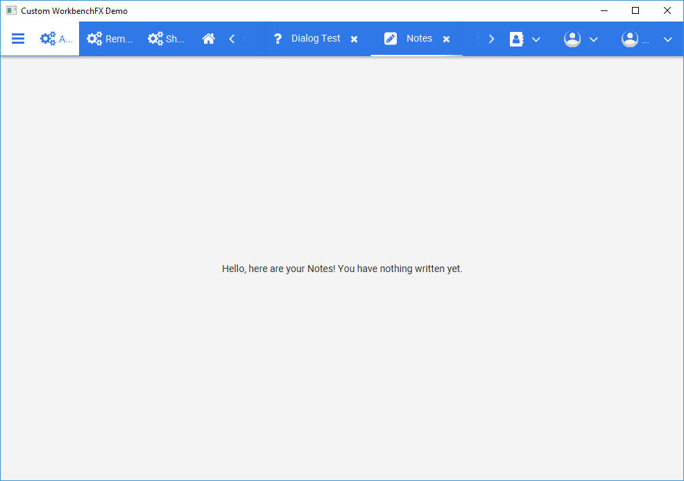
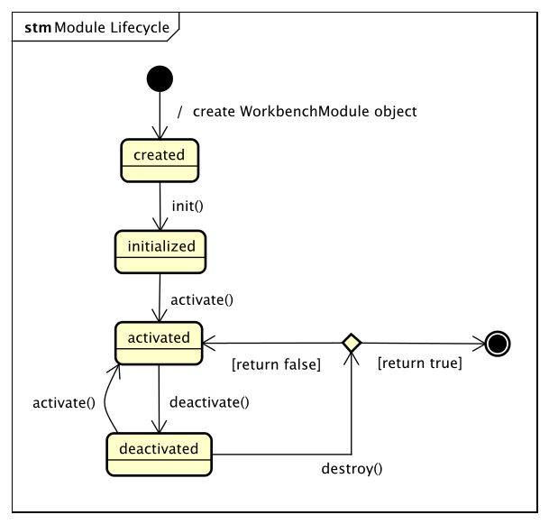
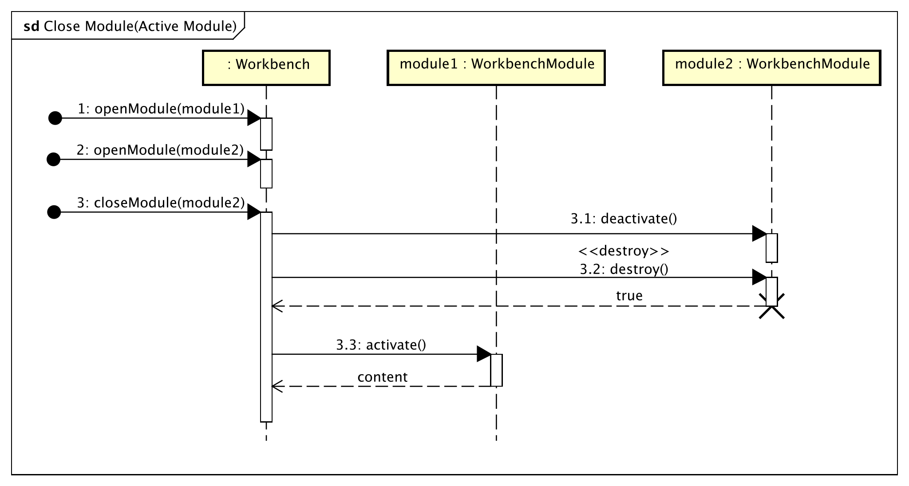

= Bachelor Thesis: WorkbenchFX
François Martin; Marco Sanfratello

FHNW University of Applied Sciences, Windisch

17^th^ of August 2018

Customer: http://www.dlsc.com[Dirk Lemmermann Software & Consulting] +
Advisor: mailto:dieter.holz@fhnw.ch[Dieter Holz‚ FHNW University of Applied Sciences] +
Examiner: https://www.inventage.com/[Edwin Steiner‚ Inventage]

// Check symbol
:y: &#10003;
// Ensures references are displayed in "Figure x" format
:xrefstyle: short

== Abstract
*WorkbenchFX* is an open source Java based JavaFX library designed to create large enterprise applications.
Using it is really simple, since we focused on an intuitive way creating the API.
We focused on a modular approach where the whole application consists of multiple views, called modules.
The API provides a great user experience, combined with a good usability and a beautiful design inspired by the Material Design guidelines.
Restyling the workbench can easily being done by simply changing `CSS` variables.

== Acknowledgements
We had a lot of help during our way to *WorkbenchFX*.
This project would not have been so successful without the help of all of the people which supported us.

First of all we would like to thank our customer, Dirk Lemmermann for making this project possible.
We also want to thank him for providing us with example code of his latest project to use as an inspiration.
Giving us constant feedback, helped a lot carrying the project forward.

We thank our advisor Dieter Holz for his support.
During the project's hacking days he took the role of the API user and tested the workbench to its limits.
His feedback led to important changes of the API syntax and even had an influence on new features.

We also want to thank Annelore Egger.
She took the role as an API tester and provided a lot of useful feedback.
Additionally she helped us a lot when she proof-read our documentation and provided feedback.

Many thanks to Horst Bauer for thoroughly proof-reading our documentation.
As an unbiased reviewer he provided additional very useful feedback.

We also would like to especially thank the UX expert, who supported us during the usability test phase.
His feedback lead to a substantial improvement of our styling and user experience.

== Introduction
WorkbenchFX is an out of the box solution to build large applications from multiple views, called modules.
It offers good user experience and a beautiful design.

A developer often starts with the views, so they can quickly show their progress to their customer.
After that, some question may arise such as:
- "How do I bring all those views together?"
- "How do I build the navigation between those views?"
- "How do I establish a good user experience?"

Exactly when those questions appear, *WorkbenchFX* comes into play:
*WorkbenchFX* allows the developer to focus on designing the views and meanwhile we're building the application around them.

*WorkbenchFX* also scales with growing requirements.
In the beginning users just want to navigate through the views, but later on they probably would want to use a menu or a toolbar.
Even that is supported by *WorkbenchFX* and the developer doesn't have to build anything by themselves.

If the developer still manages to start outgrowing the workbench, they can even replace whole parts of it with their own implementations, without having to rewrite the whole workbench.

Some of the used terms are explained in <<terms-definition>>.

.Definition of used terms during the documentation
[#terms-definition]
|===
|Term        |Definition
|Module      |The `workbench` object consists of multiple views. The object which contains the view is called `WorkbenchModule` (see <<_module_naming>>).
|Implementor |The developer which creates a custom implementation of a module
|User        |The person which uses the final application created with WorkbenchFX
|API user    |The developer which uses the WorkbenchFX API to develop their application
|===

== Motivation
Our customer told us about his latest project in which he creates a larger enterprise application.
He told us that with every new enterprise application he makes, the content is different, with the rest usually being about the same.
Larger enterprise applications often share similar functionality and therefore duplicate work is inevitable.
The idea was born to create a framework, which allows the API user to focus on the unique, interesting work, while the framework does all the boring, repetitive work for them.

== Analysis

=== Persona
During the project, three personas have been created.
They helped us a lot to focus on the main idea of the project.
Since they represent our target group, we were able to clearly recognize the features which are crucial for the success of the project.

In the beginning of the project we created two personas to focus on: SteffiFX and Anna (see <<persona>>).
In the kickoff meeting with our customer, he shifted the main focus to a third, new persona, which led to different features and changed the scope of our project.
At first we thought that it would be sufficient to design an API for long time JavaFX programmers, but then our main focus became developers with little to no experience in frontend development.

The final three personas are shown in <<persona>> below.
We refer to their names throughout in this documentation.

[cols="1,1,1"]
.Personas
[#persona]
|===
|link:include/persona/stefanie_berner.pdf[image:include/persona/stefanie_berner.png[Stefanie Berner]]
|link:include/persona/fabian_zimmer.pdf[]
|link:include/persona/anna_leutner.pdf[]
|===

=== Applications
The goal of this analysis is to look at the structural layout of different kinds of applications and to find best practices amongst them.
This way we gathered inspiration on how the design of the created workbench with our API might look like.
This helped us to decide which characteristics we want to include in WorkbenchFX.

Because there are lots of applications available, we tried to look at a variety of them to ensure a good overview.

The following sub chapters are showing each an image of the analyzed program and a table with its characteristics and (if there) some positive or negative impressions.

==== Blender
Blender is a tool for creating 3D models which are used in animated movies or in game development.
It is a tool which requires a lot of skill and is not an "every day" program.

<> gives a short impression of the program and <<characteristics-blender>> shows our findings.

.Blender
[#img-blender]
image::include/analysis/blender.png[Blender]

.Characteristics of Blender
[#characteristics-blender]
|===
|Characteristics |Positive Impressions |Negative Impressions
|Blender is divided into five sections:

- Header: The most important and common settings

- Left bar: Several tools

- Right bar: Several tools

- Footer: Animation, and view modes

- Center: The model which is created (main working area)
|
|
|All sections are resizable
|
|If their size becomes 0, they disappear.
 They can be restored, but only by using a shortcut
|The sections can be shown and hidden when they are not used anymore
|Using shortcuts to show/hide the bars
|- There is no animation, during showing or hiding

- No possibility to show/hide the bars manually
|In the top right corner: Dragging a triangle creates a new window
|Each view shows the same part, but its view is independent
(Interesting feature, but as it is a very specific feature probably not usable for WorkbenchFX)
|To remove the view, one has to drag the corner back in a certain way, which is very unintuitive
|Items in a bar can be moved manually, but only in the bar itself
|
|
|The bar itself is fixed and can't be moved
|
|
|Items in the bar can be collapsed, in order to save space and make it cleaner (like a drawer inside a drawer)
|
|
|The tools in the toolbar are stored in tabs
|
|
|When creating a new project, all settings are restored to default
|If the workspace becomes a 'mess', one can simply open a new window and everything is restored
|When a user is used to working in a certain way, they have to change the workspace every time they starts a new project
|===

==== Adobe Photoshop
Adobe Photoshop is probably one of the most widely used tools when it comes to photo manipulation and creation of digital art.
Since it requires some experience to use it properly and therefore is made primary for power users.
<> gives a short impression of the program and <<characteristics-photoshop>> shows our findings.

.Adobe Photoshop
[#img-photoshop]
image::include/analysis/photoshop.png[Adobe Photoshop]

.Characteristics of Photoshop
[#characteristics-photoshop]
|===
|Characteristics |Positive Impressions |Negative Impressions
|The workspace is divided into five sections:

- Header: A menu bar with all the different settings available

- Toolbar: Detailed adjustments for the currently selected tool

- Left bar: The most important and common tools

- Right bar: More specific and special tools

- Center: The files which are being worked on
|
|
|- Multiple windows possible

- Navigation is done with tabs
|Tabs are saving space and still show the open files
|
|Tabs can be dragged to other places (even undocking them from the tab bar)
|Sometimes useful, when wanting to see two files next to each other
|Not really necessary (rarely used)
|Tabs / tools can be placed anywhere in the application
|When using the tools, it is sometimes handy to move a tool in range
|It has advantages, but is also a little cumbersome to use.
|The workspace can be restored to default using the corresponding setting button
|Good solution
|
|Custom workspaces can be stored and switched as needed
|Nice balance between a default workspace and a power user
|
|The tools are stored in tabs and drawers
|When double-clicking on the tabs, they collapse
|They have 3 states (not likely to understand) and the collapsing behaviour is not intuitive
|===

==== IntelliJ IDEA
IntelliJ is an integrated development environment (IDE) which is used to develop a variety of programs.
The tool is made for software developers and can only be used if someone is familiar with programming.

<> gives a short impression of the program and <<characteristics-intellij>> shows our findings.

.IntelliJ IDEA
[#img-intellij]
image::include/analysis/intellij.png[IntelliJ IDEA]

.Characteristics of IntelliJ IDEA
[#characteristics-intellij]
|===
|Characteristics |Positive Impressions |Negative Impressions
|The workspace is divided into six sections:

- Header: A menu bar with different settings

- Toolbar: Buttons which are often used during development

- Left bar: Drawers used for navigating through the project. Structural features

- Right bar: Space for drawers. Used to display build functionality

- Bottom bar: Additional space for drawers and tools. Widely used for extra collapsible drawers

- Status bar: At the bottom of the window. Displays additional information

- Center: The current open file to work with
|
|
|Navigation via tabs
|
|
|When right clicking on the tab, its positioning behaviour can be decided
|Nearly every possible state is supported

- Pinned

- Docked

- Floating

- Windowed

- ...
|
|The "Remove from sidebar" button removes the selected feature from the sidebar
|
|- It's not intuitive to undo this call

- While trying to restore the feature, we discovered the option "Restore default layout", but this doesn't restore all layout changes

-> Lesson learned: Layout changes should be stored in one place
|
|
|
|===

==== Figma
Figma is a tool used for prototyping.
Using it is very easy and intuitive.
It can used by non power users.
Compared to the other tools analyzed before, its tools are fixed and defined.
The tools can't be moved or removed.
The design of the software is straight forward and is kept very simple.

It consists of five main sections:

* Menu bar on top where all the features are stored
* Toolbar below the menu bar where the most important tools are stored
* Left bar where the tree structure / navigation of the current active work is displayed
* Right bar where all important information and attributes about the selected component is displayed
* Center where the main work is being done

<> gives a short impression of the program.

.Figma
[#img-figma]
image::include/analysis/figma.png[Figma]

==== Adobe XD
Like <<_figma>>, Adobe XD is a prototyping software.
It is also very simple and intuitive.
In fact there is not much that differs compared to Figma.
So it can definitely be used by non power users.
<> gives a short impression of the program.

.Adobe XD
[#img-adobe-xd]
image::include/analysis/adobeXD.png[Adobe XD]

==== Conclusion
In conclusion after analyzing all those different programs, we can simplify them to the most important and frequent characteristics:

* A menu bar on top of the application, where all the functionality of the application is located.
* Below the menu-bar is often a toolbar, which contains the current, or most important tools represented by buttons (without collapsing).
* In the center is often the window, in which the main work is done.
* Usually there are some drawers on the left and right of the application, which are collapsible.
They contain either more tools, buttons or a tree-view for navigation.
* Sometimes another bar which is collapsible is set below the main window.
* Finally another toolbar is sometimes set on bottom of the application.
It contains the least used tools, or tools which are needed at the end of the process.

==== To IDE or not to IDE?
During our research we discovered, that there are two different kind of application types, created for two different types of users.

One type of application is created for power users:

Power users need the utmost of customizability, to ensure they can adapt the workspace to be the most ergonomic to fit their workflow.
In terms of the architecture, it could mean that it would need to allow the following:

* Separation between `Control` and `Skin`
** Skin can be replaced by API users, if they want to use a custom style
* Flexible panes
** can be re-arranged across the whole window
** different modes for fixation
*** Pinned mode
*** Docked mode
*** Floating mode
*** Window mode
*** Split mode

The other user type is the opposite to a power user:

* Simple design
* Intuitive usage
* Not much going on on the screen, so that the user can focus on the important parts of the application
* Doesn't want to customize or re-arrange parts of the application

Depending on the required user type, the WorkbenchFX API would look totally different, because both use cases require a different approach on the API design.

=== User Stories
In the beginning of the project we decided to organize a user story workshop with our customer.
Its purpose was to define personas (see <<_persona>>) and based on them to create user stories.

We followed a specific pattern when writing our user stories:
We always started with the name of the persona:
____
As Anna...
____
followed by the desired functionality:
____
...I'd like to have an intuitive way to use the application...
____
concluding with the value:
____
...so that I am not confused while working and can keep a productive workflow.
____

This way we can instantly verify if a feature is really necessary and whether it is useful or not.
This is because the story needs to fit in the context and is not just a random requirement which came to mind, without questioning its usefulness cite:[cohn_user_2004].
==== IDE Decision
During the user stories meeting we also decided which application type we would support.
As it became clear the user was going to be Anna, we knew that we would not develop an API which allows to build large power user applications like an IDE.
Anna is a person which can use a computer, but she uses it only as a tool and is not familiar with complex applications.
So we had to focus on simple, easy to understand features which are intuitive to use.

==== Differentiation to Eclipse RCP
WorkbenchFX is considered to be an enterprise application framework in JavaFX, just like Eclipse RCP is as well.
However, besides Eclipse RCP being available on the Swing platform, the goals of either are completely different.
WorkbenchFX is not meant to replace or augment Eclipse RCP for JavaFX.
WorkbenchFX is also neither a successor to Eclipse RCP.

The main focus for WorkbenchFX is to build applications like Customer Relation Management (CRM) software.
While Eclipse RCP can also do that, the user group of Eclipse RCP is the *power user*.
It allows flexible re-arrangement of parts of the GUI and features a docking framework.
This is ideal for developers, who work entirely in their IDE's and want to have the most flexibility possible to customize everything.

WorkbenchFX is not as flexible on purpose, since the *user group* is represented by *Anna* and she certainly isn't a power user.
She doesn't want to bother with moving around parts of the GUI, she just wants to get her work done quickly with good user experience out of the box.

Eclipse RCP offers lots of extension points.
WorkbenchFX only selectively offers extension points where it makes sense, but still provides good defaults.
The goal of WorkbenchFX is to quickly get an application up and running with minimal overhead.
Also, it should be possible to use WorkbenchFX without working through hours of tutorials, programming with WorkbenchFX should feel intuitive.
Eclipse RCP may offer more flexibility, but requires a lot more configuration and overhead.
This also means greater complexity and being more difficult to learn.

In the end, both can lead to the same goal, but they are meant to be used for different purposes.

=== Minimum Viable Product
To ensure shared understanding between the customer and ourselves, we agreed on a minimum viable product (MVP) cite:[olsen_lean_2015].
The outcome resulted in a very minimalistic version of the workbench, which still provides an added value compared to writing everything by hand.
The final prototype is displayed in <<mvp>>.

The MVP consists of:

* Ability to add modules to the workbench object
* The <<_workbenchmodule_lifecycle>> which enables the user to open, deactivate and close the module
* Switching between modules using tabs

[cols="1,1"]
.Minimum Viable Product (MVP)
[#mvp]
|===
|link:include/mvp/home.png[image:include/mvp/home.png[Home Screen]]
|link:include/mvp/module.png[image:include/mvp/module.png[Module Screen]]
|===

NOTE: It is interesting, that the MVP is still recognizable when using only the minimal feature of WorkbenchFX: only adding modules to the workbench. The outcome represents exactly the MVP.

TIP: The https://www.figma.com/proto/LY7jPWrDVQ5GG1zmvBdlA2MT/WorkbenchFX?scaling=contain&node-id=47%3A129[clickable MVP] is designed using the prototyping tool `Figma`.

=== Naming

==== Module Naming
To plug in functionality by the API user, we use modules.
However, as stated in <<_add_module_page>>, the name `Module` is not ideal, since that name already has a lot of associations.
Additionally, when typing `extends Module` in an IDE, it will automatically imports Java's `Module`.
This makes it frustrating, as the implementor has to manually change the import.

To avoid confusion, we want to come up with a name which makes it clearer and less ambiguous.
We did a brainstorming to come up with ideas for possible names for `Module` (<>).

.Brainstorming of possible names for `Module`.
[#img-brainstorming-module]
image::include/brainstorming_module.jpg[Module Brainstorming]

We discussed this with our customer and even though we did the brainstorming and came up with a lot of names, none of them seemed to feel "right".
Even though the name `Module` has a lot of associations, it's the only name that makes sense for what it stands for.
In the end, we decided to rename `Module` to `WorkbenchModule`.
We thought it would be easier to understand for our API users and that was the most important factor for us in this decision.
This is why we decided to stick with the word `Module`.
However, we decided to add the `Workbench` prefix, to remedy the importing issue mentioned above and to clearly separate it from the other `Module` classes in the JDK.

NOTE: <<_add_module_page>> explains what a module exactly is.

==== Navigation Drawer
We chose the name "Navigation Drawer" to be consistent with the naming in the https://material.io/guidelines/patterns/navigation-drawer.html[Material Design guidelines].
This makes sure we use the naming that will be the most familiar among other developers and is easily understandable.
An additional benefit is that if someone doesn't know what it means, they can simply look it up in the https://material.io/guidelines/patterns/navigation-drawer.html[Material Design guidelines].

=== API Design
API Users of WorkbenchFX don't only care about the API design, but also about the customizibility.

Our customer states that the intended API user would not have the need to entirely replace the `Skin`, as it is rarely done.
At first we didn't separate between `Control` and `Skin` for this reason.
Later on, our customer told us he would still consider the `Workbench` to be a `Control`, and that it would make more sense if used with https://gluonhq.com/products/scene-builder/[Scene Builder].
This is why we decided to have the `Workbench` extend `Control` and split it up into `Workbench` and `WorkbenchSkin`.
However, since we decided the API user would not want to replace the `WorkbenchSkin`, we decided to make `Workbench` and `WorkbenchSkin` final.
With this, we make it clear that `Workbench` and `WorkbenchSkin` are not designed to be subclassed.

This also means that we don't need to design the panes we use internally to be replaceable by the API user.
It is more important that the user experience is straightforward.
Still, the possibility of extending the workbench using modules is important to our customer.

=== Usability Tests
During the project we got continuous feedback from different kinds of people.
The most important outcomes from the usability tests are listed in the following chapters.

==== Dieter Holz, Advisor
During the "Hacking Days" we've made from time to time (more about them in <<_hacking_day>>), our advisor tested the API by implementing a module on his own.
This showed us some weaknesses in the API design.
We found two important findings, which are described in the following subchapters.

===== Interrupt Closing a Module
It is possible to interrupt closing a module.
For example, if someone wants to ask the user if the progress should be saved before closing, the module should not be closed immediately.
During the implementation of the dialogs, we used `CompletableFuture`{empty}s.
We also used them to achieve the interrupt closing process, since closing of the module also happens asynchronously, after false has been returned by `destroy()`.

First it made sense and it also worked.
But during the usability test, our advisor mentioned the complexity of using `CompletableFuture`{empty}s.
It is unlikely that Fabian knows what `CompletableFutures` are and we didn't want him to have an unnecessary barrier to achieve his goal.

So we figured out a much simpler solution.
Implementation details can be found in <<_workbenchmodule_lifecycle>>.

NOTE: A detailed chapter can be found in the readme.md of WorkbenchFX in the chapter "Prevent module from closing".

===== Module Toolbar
Our advisor's module had a dark background, but the tab's color was white.
This lead to inconsistent coloring and ruined the tab's look and feel.
Having Fabian to restyle everything manually was tedious and boring, so we came up with a different idea.

Since most modules would have some toolbar items, we introduced a module-specific toolbar.
It is now possible to add `ToolbarItem`{empty}s to the module.
As soon as there are items to be displayed, WorkbenchFX automatically creates a toolbar and displays it below the tab.

This way we can ensure that the implementor's modules maintain a consistent look and feel.

===== Drawer Animations
Up until the end of the project, we didn't focus on animations.
One reason we never did that was that using them in JavaFX is really cumbersome compared to animations on the web.

One of our features are drawers.
To open a drawer, an API user can call `workbench.showDrawer()`.
When showing or hiding, drawers like the `NavigationDrawer` were never showing any animation.
They just (dis)appeared.

However during the usability test we discovered that in case of other, larger drawers animations are required.
The visual feedback where the drawers were coming from and that it even was a drawer was not present.
A user wants to know from which position the drawer comes from and he is used to a sliding animation in this case.
So we decided to implement the drawers with animations (see <<_animations>>).

==== UX Expert
The biggest impact on the WorkbenchFX styling came from a UX expert.
A lot of the feedback he gave us was really helpful and we decided to adapt a lot of it.

* The active tab should be more styled like a "real" tab in a browser
* The tabs should be styleable with unique colors (which can now be done using the unique `#id`)
* Get rid of the home button and replace it with a `+` button on the right end of the toolbar
* Shrink down the size of the close icon in the tabs and make it thinner
* A small vertical border before and after the tabs would suggest the tab as an entity
* Offer the ability to have the same tabs open as when the application was last closed (this can already be achieved through storing the open modules in preferences, for example using PreferencesFX)
* It should be possible to define a default tab to be opened when starting the application (this can already be achieved by simply calling `workbench.showModule(defaultModule)` in the code after the stage was shown)
* For the tiles: Enlarge the icon, center it on top of the text
* He also suggested to split the tabs and the toolbar into two separate bars

==== Annelore Egger, User Group
She was happy using the API which motivated and showed us that we're on the right way.

===== Separating the Toolbar and Tab bar
When she looked at the top bar during the usability test, she thought all controls present in the bar were tabs and was confused what adding controls to the lists of the toolbar controls would do.
This confirmed that separating the toolbar from the tab bar was really necessary.
Having only one bar quickly lead to an overcrowding of items and tabs, which made it impossible to distinguish them.

===== Introducing ToolbarItems
As an addition to the overcrowded bar on top, she was confused with the possibility of adding every `Node` to the toolbar.
She also didn't realize the `Dropdown` control we were providing for convenience.

For those reasons we decided to restrict the possibility of adding every `Node` to one simple object:
The `ToolbarItem`.
We replaced the `Dropdown` class with this universal object.
Depending on the defined parameters, the `ToolbarItem` either becomes a `Label`, a `Button` or a `MenuButton` with appropriate styling.
If an API user still wants to use a custom `Node`, they can use the constructor which takes a `Node` as parameter.

This way it is clear what to use and no misunderstandings are possible.

== Implementation
During development of the API we've built a lot of demo modules to test it.
Those modules can be tried out when launching the `CustomDemo` in the `workbenchfx-demo` package.
This way, all features can be seen exactly in detail and in action.

=== Layout
The following chapters cover some of the most interesting topics and design decisions we encountered during the layout process.

==== Tabs
We decided to stick with the modular concept of having multiple views and switching between them using tabs.
This concept is widely used.
Most of the applications analyzed in <<_applications>> use the tab concept to switch between their files.
Also common internet browsers like https://www.google.com/intl/de_ALL/chrome/[Google Chrome] or https://www.mozilla.org/de/firefox/new/[Firefox] use the tab system too.

==== Add Module Page
Having a page which allows the user to open a new module is also commonly used.
For example smartphones use such a concept, when they display icons of installed apps on the home screen and open them on click.

For this reason we decided to go with a system, where the user could click on a certain button which opens an overview with all of the modules in a grid.
Clicking on one of those buttons (called `Tile`) would open the module.
This way, the user has a good overview on all the modules and can easily open them.

Going with this concept triggered a discussion about naming the components.
When we described the concept, we struggled with the naming of the module.
Viewed objectively, the complete application built with WorkbenchFX consists of multiple "mini applications".
For obvious reasons we could not name the module "MiniApplication".
An API user could be confused about the difference between the application itself and the "mini applications".
So we had to find a better name.
In the end we chose `WorkbenchModule`, which also was not the best solution, since the part "module" has a lot of associations.
But it is definitely a better choice than "Application" (the complete naming process is described in <<_module_naming>>).

When having a lot of modules, the available space on the page would shrink quickly and the usability would also suffer.
For that reason we introduced a pagination to have only a restricted amount of modules displayed on the page.

==== Changes across Versions
There are three major changes mentionable which appeared during the project.

* The phase when we were <<_writing_our_own_stylesheet, writing our own stylesheet>> without any help of external sources.
* The phase where we were <<_switching_to_the_material_design_guidelines, switching to the Material Design guidelines>>.
* The phase after the usability tests, where we were <<_separating_the_toolbar, separating the toolbar>> into the toolbar on top and the tab bar below and decided to completely switch to Material Design.

===== Writing our own stylesheet
In version `v1.1.1` we had the opinion that we have a really good styling.
To be fair: It was the first version which looked acceptable.
<<v111>> gives a first impression on how the style looked at that time.

[cols="1,1"]
.v1.1.1
[#v111]
|===
|image:include/versions/v1.1.1 - 1.png[v1.1.1-1]
|image:include/versions/v1.1.1 - 2.png[v1.1.1-2]
|===

Later on in the project we realized, that the white gaps between the toolbar items on top didn't provide good readability.
It also took up too much space.
At one point we decided to have a look at common style guidelines to improve our styling.

We felt, that Google's https://material.io/design/[Material Design] guidelines are a pretty good starting point, since their flat design approach is being used in a lot of applications and they are providing the guidelines open source cite:[noauthor_design_nodate].

===== Switching to the Material Design guidelines
This was a huge step in terms of usability.
One major improvement was to change the background color of the toolbar to the primary color.
We also changed the way the active tabs were looking to a more material like appearance with a white border below the active tab cite:[noauthor_tabs_nodate].
<<v120>> shows the styling in version `v1.2.0`.

[cols="1,1"]
.v1.2.0
[#v120]
|===
|image:include/versions/v1.2.0 - 1.png[v1.2.0-1]
|image:include/versions/v1.2.0 - 2.png[v1.2.0-2]
|===

However, the active tab styling this way showed us that Material Design *is* only a guideline.
The way those tabs are styled adapts mainly to tabs with only text cite:[noauthor_tabs_nodate].
Since we have an icon, text and a close icon, there was a lot going on in the tab bar.
Especially when having a lot of modules open, the application looked crowded.
<<v150>> below shows how horrible the styling was when opening a lot of modules.

.v1.5.0
[#v150]

[TIP]
====
Therefore we came to the conclusion, that testing boundaries is not just recommended but crucial to the success of a project.
The visual appearance with only a few open modules and only a few items in the toolbar looked nice.
But testing use cases with a lot of items revealed the issue.
====

It is obvious that this styling had to change.
After the <<_usability_tests>> and a lot of feedback we changed the styling again.

===== Separating the Toolbar
At first we were worried that separating the toolbar into two bars would take up too much space of the window.
But this trade-off proved to be a worthwhile decision.
We also decided to rework the styling a little bit.
<<v160>> shows the final result of the separation.

[cols="1,1"]
.v1.6.0
[#v160]
|===
|image:include/versions/v1.6.0 - 1.png[v1.6.0-1]
|image:include/versions/v1.6.0 - 2.png[v1.6.0-2]
|===

A direct comparision approves this decision (<<v150vs160>>).

[cols="1,1"]
.v1.5.0 vs v1.6.0
[#v150vs160]
|===
|
|image:include/versions/v1.6.0 - 8.png[v1.6.0-8]
|===

The colors of the tiles were also changed to white.
Having the tiles in a color with a white background created an optical illusion where the brain imagines colored, blurred dots between the spaces of the tiles.
An example of the created illusion is shown below (<<illusion>>).

.Optical Illusion
[#illusion]
image::include/versions/illusion.png[Optical illusion]

==== Easy Styling
Our most important goal was to enable Fabian a simple way to style his application in a very simple way.
Of course he would not take advantage of all of the styling possibilities.
But we thought he might want to change at least the default color theme of the workbench.

We wanted to have Fabian only change a few color values which would restyle the whole application.
To achieve this we worked with `CSS` variables.
We defined all of the color variables in the `.root > *` selector of the `CSS` file and used  only those variables throughout the whole stylesheet.

During the definition of the color variables, we discussed their names and usage in the workbench.
In the end we decided to go with the Material Design naming convention of colors and to use them as defined cite:[noauthor_color_nodate].
This way, every API user is able to research on how to use the variables and in which context they are used.

By simply using the color variables, Fabian can create a custom stylesheet, assign it to the workbench and overwrite the colors he'd like to change.

TIP: To visualize the simplicity of changing styles, a `darkTheme.css` is referenced in the `CustomDemo.java` file located in the `workbenchfx-demo` package.

SteffiFX on the other hand might want to style the application a bit more.
For this case we gave every component used in the workbench either an `#id` or a `.class` name.
This way SteffiFX is able to restyle the complete application if she'd like to.

NOTE: A detailed chapter about restyling the application can be found in the readme.md of WorkbenchFX.

=== Architecture
Since WorkbenchFX will be made open-source as a framework, the architecture is a critical part.
We need to have a good architecture so it will be possible for contributors in the future to extend WorkbenchFX with new features via pull requests.
Also, we need to think about which API's to expose, since these are the API's we need to support in the future.
Once WorkbenchFX is launched to the public, changes to the public API need to ensure they are not breaking changes.
This means we can only very carefully introduce changes later on, and need to make sure the architecture is already good enough, so it doesn't have to be fundamentally changed after the public release.

==== Constructing the Workbench
Since we want to enable the API user to customize the workbench as much as possible, we need to think about in which way the API user should need to interact with our API to do so.
Of course, the resulting API design from this needs to work with our implementation as well.
When we implemented the pagination on the add module page, we wanted the API user to be able to choose the amount of modules shown per page.
To do so, our initial idea was to design the API for creating a `Workbench` object like this:
[source,java]
----
Workbench.of(module1, module2)
           .modulesPerPage(10);
----
This would be very easy to use, but it turned out to be not practical, since the `GridPane` with the module tiles are being initialized in the constructor of `Workbench`.
Changing the amount of modules per page after the constructor was called, would mean that we would have needed to rebuild all of the pages with the modules again.
This is not only very inefficient, but also a very bad solution for this problem.

Another way of solving this would've been to initialize the `Workbench` object with a separate method after setting the amount of modules per page, like this:
[source,java]
----
Workbench.of(module1, module2)
           .modulesPerPage(10)
           .init();
----
This would mean that the `GridPane` with the tiles would only need to be built once.
However, this solution is also not very elegant.
If the API user doesn't want to set the amount of modules per page, they still need to call "init()".
Also, in this case the API user must remember to call `init()`, which is easy to forget.

One of the better options would be to solve it like this:
[source,java]
----
Workbench.of(10, module1, module2);
----
We would simply pass in the amount of modules to the `.of()` method.
This would work, however it has some disadvantages.
For example, the readability suffers: "What does that 10 mean again?".
Also, since we want the API user to be able to define their own controls for the tabs and tiles using factories, we noticed that we also need to pass those factories in the same way.
This would not only make the readability worse, but this also means that if we want to stick to our paradigm, we would need to add multiple overloaded `of()` methods.
With 3 parameters (modules per page, tab and tile factory) this would result in the combinations in <<combinations-overloaded-workbench>>.

.Combinations of overloaded Workbench.of() methods
[#combinations-overloaded-workbench]
|===
|No. |Modules per Page |Tab Factory |Tile Factory

|1
|
|
|

|2
|{y}
|
|

|3
|
|{y}
|

|4
|
|
|{y}

|5
|{y}
|{y}
|

|6
|
|{y}
|{y}

|7
|{y}
|{y}
|{y}
|===

Only 3 parameters result in 7 overloaded `of()` methods, which is already quite a lot.
Should we need to add more parameters in the future, it would get even worse.

This is why we decided to go with our final solution, to *use the builder pattern*.
Using it results in the following syntax:
[source,java]
----
Workbench.builder(module1, module2)
           .modulesPerPage(10)
           .build();
----
This solution solves all of the problems.
It's not possible to forget `build()`, since else it won't return a `Workbench` object.
It's expandable to a large amount of parameters.
It allows for maximum flexibility, i. e. any combination of the parameters in any order can be specified.
We decided against keeping the original `Workbench.of(module1, module2)` notation, since using the builder doesn't require a lot more code and doesn't introduce more complexity.

==== WorkbenchModule Lifecycle
The following UML diagrams explain how the lifecycle of a `WorkbenchModule` works.
The diagrams are simplified to a degree that is relevant for the implementor of a `WorkbenchModule` and are *not* complete and *not* exhaustive by design.
The goal is to explain the principle of interactions on modules when using `workbench.openModule(WorkbenchModule)` and `workbench.closeModule(WorkbenchModule)` with a minimal amount of examples.

*Generally*, when clicking on a tile in the `AddModuleView`, `workbench.openModule(WorkbenchModule)` gets called. +
When clicking on the `x` icon of a tab, `workbench.closeModule(WorkbenchModule)` gets called. +
When a `WorkbenchModule` has to perform cleanup actions or needs to show a dialog before it can be closed, the closing process needs to be interrupted.
To interrupt the closing process, the implementor has to return `false` on `module.destroy()`.
When the closing process gets interrupted, the module will not be closed and will be set as the active module.
The implementor doesn't have to call any of the lifecycle methods, the calls are being made by the `Workbench`.

Overview of the lifecycle in a state diagram, showing all state changes that can occur (<>).

.Module Lifecycle.
[#img-module-lifecycle]

Process of opening two modules in sequence, followed by opening the first module again (<>).

.Opening of modules.
[#img-open-module]
image::include/UML/svg/Opening of Modules.svg[Opening of Modules]

Two open modules, closing of the active module (<>).

.Closing of modules, active module.
[#img-close-module-active]

Two open modules, closing of the inactive module (<>).

.Closing of modules, inactive module.
[#img-close-module-inactive]
image::include/UML/svg/Close Module Inactive.svg[Close Module Inactive]

Two open modules, closing of the active module, where the call to `module.destroy()` returns false (<>).
This leads to the closing process getting interrupted.
The implementor of `WorkbenchModule` can then choose to do cleanup actions or open a confirmation dialog, following a call to `module.close()`, when the module should definitely be closed.

.Closing of modules interrupted, active module.
[#img-close-module-interrupt-active]
image::include/UML/svg/Close Module Interrupted Active.svg[Close Module Interrupted Active]

Two open modules, closing of the inactive module, where the call to `module.destroy()` returns false (<>).
This leads to the closing process getting interrupted.
The module which interrupted the closing process will be opened, so that the user's attention will be directed towards the interrupting module, so they can take appropriate actions.

.Closing of modules interrupted, inactive module.
[#img-close-module-interrupt-inactive]
image::include/UML/svg/Close Module Interrupted Inactive.svg[Close Module Interrupted Inactive]

To learn more about the interactions in detail, look at the tests below, since the tests verify the exact order of the calls and cover more situations in detail:

* <<test-reference.adoc#_open_modules,Opening of Modules>>
* <<test-reference.adoc#_close_modules,Closing of Modules>>
* <<test-reference.adoc#_close_modules_interrupted,Closing of Modules Interrupted>>

===== Challenges
Designing the module lifecycle was a challenge we didn't expect.
There were a few goals we wanted to achieve:

* Easy to understand
* Self-explanatory sequence and ordering
* Require the least amount of work from Fabian to use it
* Fulfill the needs of Steffi, cover as many use-cases as possible
* Easy to use, even for complex scenarios

If we make it too complex, Fabian could get confused. +
If we require lots of work to use it, Fabian could get frustrated. +
However, if we make it too easy, Steffi can't cover all of her use cases. +
At the same time, making it more complex potentially makes it less self-explanatory, which in turn makes it harder to use.

The challenge was to strike a balance between complex and easy, ensuring both Fabian and Steffi would be happy with the API.

The first design decision we made was to have `WorkbenchModule` as an abstract class.
This way, we can already pre-define as many lifecycle methods as possible, so Fabian has the least amount of work.
Still, we enable Steffi or even Fabian in some more advanced use cases to override the lifecycle methods they need, to augment or replace the implementation with their own.
The compromise here was to have `#activate()` as the only lifecycle method that *must* be implemented, as it returns the view of the module that should be displayed.
But, since the only thing Fabian has to define is `return view;`, which is acceptable.

We realized every module needs a reference to the `Workbench`, but we can't pass it in the constructor, since at the time of the construction of a `WorkbenchModule`, the `Workbench` doesn't exist yet.
This lead to the `#init(Workbench)` lifecycle method, which initially sets the `workbench` reference, but also allows implementors to initialize their module.

Then, we knew we needed lifecycle methods, so the implementor can know whether their module is the currently active module, which lead us to `#activate()` and `#deactivate()`.
This makes it possible for example to have certain module-specific menu-items in the `NavigationDrawer` or `ToolbarItem`{empty}s in the Toolbar, by adding them with `#activate()` and removing them with `#deactivate()`.

Finally, we need to allow the implementor to free up resources when a module is closed, which lead us to the `#destroy()` lifecycle method.
This was a bit of a challenge itself though, since initially we thought it would be enough to have `void` as the return type.
Then we realized there could be a use case, in which the implementor may want to open a confirmation dialog before a module is being closed.
Again, we thought about different possible solutions and decided to return a `boolean`, allowing the implementor to specify whether the module can be closed or not.
In case of a confirmation dialog before closing the module, the implementor can simply return `false`, causing the closing of the module to get interrupted.

==== API Design of WorkbenchModule
As with the design of the lifecycle, having a simple and easy to understand API overall for `WorkbenchModule` is very important to us.
If there is a lot of code with a lot of methods in the `WorkbenchModule` class, it could make it harder for people to understand how to use the API and how it works.
This is why we very carefully introduced complexity into a `WorkbenchModule`, and only added what really enhanced the user experience to a point that would justify the added code.
We also considered to only add methods which are needed to fulfill a certain use case, which is likely to occur.

===== Added API
One part of a `WorkbenchModule` are its identifying properties.
We decided for a `WorkbenchModule` to have a *name* and an *icon*.
They are necessary, because they are shown in tabs and tiles representing each `WorkbenchModule`.

Every `WorkbenchModule` also has a reference to the `Workbench` object.
This makes it possible to individually adapt the `Workbench` by calling `getWorkbench()`.
This enables the `WorkbenchModule` to have full control over the `Workbench`, for example to switch to other modules.

When we added the module toolbar, we also thought it would make the most sense to include the lists with the `ToolbarItem`{empty}s in the `WorkbenchModule` itself, as they are specific for each module.

===== Rejected API
Generally, we decided to not include anything that wasn't strictly specific to a `WorkbenchModule`.

For example, we discussed whether or not to include a list with `WorkbenchModule` specific `MenuItem`{empty}s to be shown in the `NavigationDrawer`.
In the end, we decided against it, since the `NavigationDrawer` contains global `MenuItem`{empty}s.
If there was one list in `Workbench` and one in each `WorkbenchModule`, API users could get confused.
API users who don't know of the global list in the `Workbench`, could falsely think the `NavigationDrawer` is specific to each module, causing them to add the same `MenuItem`{empty}s in each `WorkbenchModule`.
Additionally, some possible open questions it could cause would be:

* Is there a separate module-specific `NavigationDrawer`?
* Does the list of `MenuItem`{empty}s in the `WorkbenchModule` override or augment the list in the `Workbench`?
* How are the module-specific and global `MenuItem`{empty}s separated?
* Are the module-specific `MenuItem`{empty}s inserted on the top or the bottom?

API users are still able to define module-specific `MenuItem`{empty}s with the already existing API, by adding them to the global list in `activate()` and removing them in `deactivate()`.
This way, we give the API users the choice of how to include them and they don't miss out on any functionality.
It also eliminates the "guessing" of how it was implemented, as it can be observed above in the possible open questions.

==== Icon: Node vs File vs Image
To specify an icon for a `WorkbenchModule`, there are different ways to implement this in the API.

===== Node
The most generic option would be to have the API user pass in a `Node` in the constructor to use as the icon.

The problem is that we display the icon in two places: one in the `Tab` and one in the `Tile`.
The JavaFX API of `Node` is designed to have zero or one parent cite:[noauthor_node_nodate].
This means the API user would need to pass in two `Node` objects, one for the icon of the `Tab`, and one for the `Tile`.

Since the icon will always be the same for the `Tab` and the `Tile`, this feels very redundant and is very error-prone.
Should the implementor not know about this, they could pass in the same `Node` twice and wonder why only one icon is being displayed.
This could cause the implementors to believe this to be a bug.
Sure, we could check in the constructor if both `Node`{empty}s are referring to the same object, but it's still not very user-friendly.

===== File
Another option would be to have the API user pass in a file, referring to the path of the icon.
This way, we don't have the same issues as mentioned in <<_node>>.
However, it is quite limiting, since if the API user wants to use an icon from Font Awesome or Material Design Icons, they would need to find the icon as an image and refer to the file.
This is quite cumbersome, compared to using the `FontAwesomeFX` library and simply specifying `FontAwesomeIcon.GEAR` for example.
Also, this would not allow API users to make use of JavaFX' support for image files with multiple scaling factors, to account for different display resolutions cite:[lemmermann_javafx_2017].

===== Image
We decided to use `Image` as one of the options of passing in an icon in the constructor of `WorkbenchModule`.
There are none of the issues mentioned in <<_node>>, since the `Image` will be wrapped in an `ImageView`, when `module.getIcon()` gets called by the `Tab` and `Tile`.
Also, it allows API users to make use of JavaFX' support for image files with multiple scaling factors cite:[lemmermann_javafx_2017].

Unfortunately, it doesn't solve the issues with icons from libraries, as mentioned in <<_image>>.
To solve this, we looked at what were the most widely used icon libraries.
Font Awesome is the most popular icon set, which is why we chose to include it as another option in the constructor cite:[noauthor_font_nodate].

Also, since the design of WorkbenchFX is highly influenced by Material Design, we wanted to include an icon set that would include Material Design icons.
FontAwesomeFX offers support for the https://material.io/tools/icons/?style=baseline[official Material Design Icons by Google] and also https://materialdesignicons.com/[Material Design Icons] cite:[noauthor_fontawesomefx_nodate].
Since all of the icons from the https://material.io/tools/icons/?style=baseline[official Material Design Icons by Google] are included, along with many others in the icon set of https://materialdesignicons.com/[Material Design Icons], we also included a constructor option for https://materialdesignicons.com/[Material Design Icons].

==== Model View Presenter
Model View Presenter (MVP) was used as general architecture pattern.
We thought it was overkill to use the `Control` and `Skin` architecture from JavaFX for all internal views as well, especially since they don't have to be replaceable (see <<_api_design>>).
But at the same time, we wanted the views to be separated to be more readable and maintainable.
We chose the MVP pattern because we used it in the https://github.com/dlemmermann/PreferencesFX[PreferencesFX] project and it proved to be very good for those purposes.
This is why we still chose to use the MVP pattern for all internal views.
At first, we used a separate `WorkbenchModel` object for the model.
Our customer suggests that it would be easier to skip the `WorkbenchModel` class and just put the logic in `Workbench`, since that's the place where he would expect such logic.
We decided to change it in a way that `Workbench` is the model object in the MVP pattern in our case.
This simplifies the architecture and readability is improved, since methods are where they would be expected.

`View` is an interface, because it's used as a mixin.
We implemented it this way because every view needs to already extend a certain JavaFX class and multiple inheritance is not possible in Java, so using an abstract class here isn't an option.
This makes it possible to initialize all views in the same way while also resulting in less code duplication, since the `init()` method and the JavaDoc doesn't need to be rewritten over and over again.
`Presenter` is abstract, because it acts more like a "super class" of all the presenters.
Since all presenters don't need to extend anything else, using an abstract class here is possible.

==== Overlays
To enable the API user to easily show a custom overlay with the option of having a black transparent `GlassPane` in the background, they can use the respective `workbench.showOverlay()` and `workbench.hideOverlay()` methods.
The `GlassPane` prevents click events on the components below and adds a scrim to the background.
Unless a blocking (modal) overlay is being displayed, clicking on the `GlassPane` closes the overlay.

The GUI of WorkbenchFX is organized in layers.
At all times, there is a layer of the general WorkbenchFX GUI, which is being represented by the view class `WorkbenchView`.

When showing an overlay, a `GlassPane` is added to the scene graph and shown on top of the WorkbenchFX GUI, followed by the overlay itself on top of the `GlassPane`.
This ensures there is a "scrim"cite:[noauthor_elevation_nodate] between the WorkbenchFX GUI and the overlay (<<overlay-scrim>>).

.Overlay with GlassPane (scrimmed background)
[#overlay-scrim]
image::include/overlay.png[Overlay with GlassPane (scrimmed background)]

When hiding an overlay, it is made invisible and is not removed from the scene graph, so recurring overlays don't need to be re-inserted into the scene graph again.
This is more efficient and especially overlays with animations profit from this design, since they run smoother when shown and hidden multiple times.
In case of an application with very memory-intensive overlays, there is a possibility to call `workbench.clearOverlays()`, which will remove all overlays from the scene graph and free them up to be garbage collected.

Each overlay has its own `GlassPane` and it is possible to open multiple overlays on top of each other.

NOTE: While it is not recommended to open an overlay on top of another overlay, it frees the API user from having to account for timing / concurrency issues (see <<_challenges_2>>) during transitions between overlays.

===== Challenges
At first, we designed the API to not allow multiple overlays to be shown on top of each other.
This enabled us to have one `GlassPane` and one `DialogControl` to use for all overlays.
We would then simply exchange the `WorkbenchDialog` model object in `DialogControl`, which would cause the `DialogControl` to change accordingly.
This prevented the API user from the bad practice of showing multiple overlays on top of each other. +
However, this lead to timing / concurrency issues when switching from one overlay to another.

When closing the stage with two open modules, which both would interrupt the closing process with a dialog, confirming the close on the first dialog would cause no dialog to be shown at all, even though the closing dialog of the second module should've been shown.
It turned out calling `showOverlay()` to show the second dialog was called fractions of a second earlier than `hideOverlay()`.
This resulted in the second dialog to be shown first, which was then hidden with the call to `hideOverlay()`.
Since the whole process is asynchronous and highly depends on the changes in JavaFX's scene graph that are out of our control, we decided to allow multiple overlays to be shown on top of each other.
Since the overlap during the transition between two overlays is so minimal that it can't be seen, this is not a problem visually.
Even if we would've gotten the synchronization right internally, it would still mean an API user choosing to show two subsequent overlays would need to account for timing / concurrency issues as well, which was not acceptable for us.

Initially we also designed the API in a way that would require overlays to be loaded, either with a separate method call or during the creation of `Workbench`, before they could be shown.
While this resulted in the best performance possible, since the overlays could be loaded hidden with the start of the application, it made the API more complex.
Since changes in the scene graph can be performed quite quickly by JavaFX, resulting in the performance benefits to not be significant, we decided to change the API to load the overlays into the scene graph as they are being shown.
But we decided to go for a compromise: we would still not remove the overlays when they are being hidden, to make sure they can be loaded faster the next time they are being shown, since they already have been added to the scene graph.

== Processes
To ensure we can efficiently work together in a team on the code, we employed some processes.
We found it very useful to have defined processes, as we knew exactly what we had to do in every step of the project.
It was clear to us what we expected from each other and it worked very well this way.

=== Development
During our development, we made extensive use of GitHub's features.
We especially appreciated GitHub for doing code review and its releases feature.

Also, since one focus was the visual design of WorkbenchFX, we used CSS a lot, which lead us to using SCSS.
We are very happy about this decision, since it made the CSS code much more readable and also maintainable.

==== GitHub
The programming is being done in a GitHub repository.
We work using the git flow branching model cite:[noauthor_successful_nodate].
Every change is represented in a pull request to develop from the feature branches.

==== Code Review
To improve the quality of the code and also ensure https://www.agilealliance.org/glossary/collective-ownership/[collective code ownership], every pull request gets code reviewed by the other person.
This worked very well for us, since comments that were made by the other person always lead to improvements and code of higher quality.

==== SCSS instead of CSS
In web development the transpiler `SCSS` to `CSS` is commonly used.
But we were not finding much information about using it in `JavaFX` projects.
But because `SCSS` is:

* much easier to write
* easier to read
* less code is needed the more complex the styling becomes
* provides much more features compared to `CSS`

we decided to give it a try.

For example, lets say we're having an application with two views fit in one larger view.
All three views have some default colors.
If we want to change the colors on hover we would need to write the following `CSS` code:

[source,css]
----
.myClass {
  -fx-background-color: RED;
}
.myClass .innerClass {
  -fx-background-color: BLACK;
}
.myClass .otherInnerClass {
  -fx-background-color: WHITE;
}
.myClass:hover {
  -fx-background-color: BLUE; /* Change from RED to BLUE on hover */
}
.myClass:hover .innerClass {
  -fx-background-color: WHITE; /* Change from BLACK to WHITE on hover */
}
.myClass:hover .otherInnerClass {
  -fx-background-color: BLACK; /* Change from WHITE to BLACK on hover */
}
----

The code appears to be redundant and not very readable.
`SCSS` on the other hand:

[source,sass]
----
.myClass {
  -fx-background-color: RED;
  & .innerClass {
    -fx-background-color: BLACK;
  }
  & .otherInnerClass {
    -fx-background-color: WHITE;
  }

  &:hover {
  -fx-background-color: BLUE; /* Change from RED to BLUE on hover */
    & .innerClass {
      -fx-background-color: WHITE; /* Change from BLACK to WHITE on hover */
    }
    & .otherInnerClass {
      -fx-background-color: BLACK; /* Change from WHITE to BLACK on hover */
    }
  }
}
----

It is much easier to read thanks to the nested code writing.
The code is also maintainable.
If additional stylings are required, they can simply be added.
`SCSS` will become handier and more powerful as the complexity of the stylesheet increases.

TIP: IntelliJ plugin to transpile https://www.jetbrains.com/help/idea/transpiling-sass-less-and-scss-to-css.html[SCSS to CSS]

==== CSS Conventions
In order to maintain a well structured styling we agreed on several conventions.
The most important are described as follows.

===== Using the Material Design Variables
As stated in <<_easy_styling, Easy Styling>> we didn't want Fabian having to worry about restyling.

Therefore we agreed on using only variables for styling, so that Fabian has to change only a variable to restyle the application.
Of course, not only Fabian profits from this convention but we do so too.
Thanks to variables we didn't have to worry about color codes and changing them.

Using the variable names and using Material Design will also be of use in the future.
This way we have not to worry about future developers not knowing how the colors are used and how to use them cite:[noauthor_color_nodate].

===== Replacing Units
We agreed on using `em` as size measurement and not `px`.
This makes the views more responsive, since when changing the default size of the font, the overall styling automatically adapts the actual size.

However, sometimes it is more useful to write in pixels than in `em`.
For instance, it much simpler to write `60px` instead of `4.286em` (base font size: 14px).

One of the features of `SCSS` is defining functions.
We wrote a little <<pixel-converter>> which allowed us to convert pixels into `em` and agreed on using the function when working with a pixel value.
[source,sass]

.Pixel Converter Function
[#pixel-converter]
[source,sass]
----
@function px($px) {
  @return 1em / 14 * $px; // 14px is defined by the default material design font-size
}
----

===== Working With Imports
Another convention we use is the separation of all scss-files.
For readability we have the `main.scss` file separated into multiple scss files.
In the `main.scss` we include all those other files and this "main file" will be compiled as a css file.
Using the `@include` tag looks like this:
[source,sass]
----
@include file1;
@include file2;
@include file3;
----
The files to be included are named with an underscore as prefix: `_file1.scss`.

=== Testing
Code quality is one of our main priorities in this project.
Since the framework is meant to be used in enterprise applications as well, WorkbenchFX needs to be robust.
Also, we wanted to rather have less features, but of better quality.
One of the criteria in the definition of done is having unit tests for the code.
We would not merge a pull request before the tests are all done and passed.
This improved the code quality by a lot, since we found around two bugs (sometimes less, sometimes more) per pull request during testing.

We thought about using Test Driven Development (TDD), but because the framework is new, the API was not clear from the beginning.
Since we had a focus on good "usability" of the API, it changed a lot during development.
This is why we decided not to do TDD, because it meant we would have needed to constantly adapt the tests to the changing API in the beginning of the development, which would be very inefficient.

Unit testing also had the advantage that it "forced" us to have a good architecture.
If the architecture isn't good, it is very hard to test in an isolated way.
We employed the pattern of _Dependency Injection_ whenever we could, since that made one of the biggest differences in testable code for us.

==== JUnit vs Spock
Most of our unit testing, especially in the beginning, was done by using JUnit.
However, when there were some test cases that were data-driven.
JUnit 5 does have data-driven testing capabilities, but it doesn't offer much flexibility and the way tests have to be implemented to be data-driven is not very readable cite:[bechtold_junit_nodate].
An example can be seen in <<junit-parameterized>>.

.Parameterized Tests with JUnit 5 cite:[bechtold_junit_nodate]
[source,java]
[#junit-parameterized]
----
@ParameterizedTest
@ValueSource(strings = { "racecar", "radar", "able was I ere I saw elba" })
void palindromes(String candidate) {
    assertTrue(isPalindrome(candidate));
}
----

Also, JUnit 5's data-driven testing API is still considered "experimental" cite:[bechtold_junit_nodate].
We didn't want to risk all of our data-driven tests becoming obsolete, should JUnit later choose to change the concept entirely.
Combined with the readability argument, we decided not to do data-driven testing with JUnit.

At first, we proceeded to write the data-driven tests as usual in JUnit.
But they had lots of duplicated code and therefore were not very maintainable (see <<comparison-junit-spock>>).
We decided to invest some time to find a better solution.

We already knew Spock as a testing framework, but we have never used it before in a Java context, since Spock is written in Groovy.
However, Spock has one big advantage over JUnit: Data driven testing is very well implemented.
Parameters in data-driven tests are implemented in a table-like format (see <<comparison-junit-spock>>).
A test case can be built fully parameterized, which means the tested method and assertions only need to be written once.
Spock will then dynamically run the test case multiple times with each row of the table-like data structure as parameters cite:[niederwieser_data_nodate].
This makes the code much more readable and maintainable.
It also means adding another data set after the fact just means adding another row to the data, not copying and modifying unit test code over and over again.

However, it was still unclear whether we could use Spock to test Java code and even more so JavaFX applications, which are already more difficult to test.
In theory it should be possible, as Spock claims on their website cite:[noauthor_spock_nodate].
At least TestFX (see <<_testing_utilities>>) offers support for Spock, so it seemed like a viable option.
We did some research on GitHub, but we didn't find any Java projects which used *JUnit 5* together with Spock and *Maven*.
After a lot of challenges, we were able to make it work.
The key part to the solution, was that we needed to add the JUnit Vintage Engine, which is the engine that enables to run JUnit 3 and 4 tests cite:[bechtold_junit_nodate].
Everything that was needed to make it work can be seen in the <<misc-reference.adoc#_maven_code_pom_xml_code_workbenchfx_core,`pom.xml` file of `workbenchfx-core`>>

However, the end result was well worth the effort.
We rewrote the data-driven JUnit 5 test with lots of duplicated code mentioned above with Spock and compared both in <<comparison-junit-spock>>.

.Comparison of a Data Driven Unit Test with JUnit 5 and Spock
[#comparison-junit-spock]
image::include/comparison_junit_spock/comparison_junit_spock.png[Comparison of a Data Driven Unit Test with JUnit 5 and Spock]

Not only is the unit test written with Spock much more readable, but also easier to maintain.
The output is much easier to read with Spock as well, since it creates a separate test for every row in the parameters.

==== Testing Utilities
There were a few testing utilities we used to augment the already existing features of JUnit and Spock.

===== Mockito
We used Mockito for mock testing with JUnit.
Used in combination with the dependency injection pattern, it enabled us to test classes in a more isolated way.
For example, it allowed us to mock the view classes, so we could test presenter logic separately.

===== TestFX
Using TestFX made it even possible to test JavaFX code.
Without it, JavaFX will throw `IllegalStateException: Toolkit not initialized` for all method calls that run on the GUI thread.
TestFX also offers the possibility of automated GUI testing, which we decided not to make use of because of the fragile nature of those tests.
We used unit tests whenever possible and when it wasn't, we used integration tests.
See the tests in `workbenchfx-core/src/test` for more information.

===== Awaitility
After we implemented the animations for the drawers, some tests were failing.
Because of the animations, there is a delay of 200 ms before the drawer gets hidden.
The problem is, the assertions which check if the drawer is not visible run before the animation has finished (the drawer is hidden).

This was quite a challenge, since `Thread.sleep()` and other strategies didn't help at all, as they probably were just sleeping the GUI thread, which didn't help with the issue.
We then stumbled upon _Awaitility_, which was made for testing asynchronous logic.
By using it, we were able to specify a condition and a time frame, in which the condition(s) should be met (see <<awaitility-unit-test>>)
Awaitility does the rest and performs the assertion.

We found Awaitility to be quite useful for this purpose, as it worked flawlessly and was easy to use.

.Unit test with Awaitility
[source,java]
[#awaitility-unit-test]
----
include::{dir-test-java}/WorkbenchTest.java[tags=awaitility]
----

=== Building

==== Travis CI
To simplify the code review process, we are using Travis CI.
Travis CI is a build server similar to Jenkins.
Compared with Jenkins, it runs in the cloud and is much more straight forward to set up in our experience.
The biggest advantage is the tight integration with GitHub, which for example allows automatic building of pull requests.
GitHub then directly shows the build status in every pull request and we also set up that a pull request can't get merged until the build passes.
With every build, Travis will compile the code, run checkstyle and tests.

We agreed with our customer to use the Google Java Code Style guidelines, as they are used in one of the most-widely used libraries in Java, Guava cite:[idan_top_2017], and because of its well-maintained open source checkstyle configuration on GitHub cite:[noauthor_checkstyle:_2018].
If checkstyle finds code style violations, we set it up to fail the build.
This provides us with immediate feedback when we open a new pull request and forgot to run checkstyle checks ourselves.
Also, it makes it easier for the reviewer, since they don't need to run the tests and checkstyle themselves every time.

In order to get build results from Travis faster we enabled "Auto Cancellation".
If there are a lot of pushes from the same branch or pull request, Travis will then cancel all but the most recent build in the queue for each branch or pull request.

Travis makes two checks each time you make a push to the repository.
The first check is the "push-check", which tests the compatibility of the current branch (<<travis-check>>) cite:[noauthor_travis_nodate].
The second one is the "pr-check", which emulates a merge with the target branch in order to check if the merge leads to errors making the build fail (<<travis-check>>) cite:[noauthor_travis_nodate].
This has the huge advantage that our work is not only easier but also safer to accomplish.

.Check by Travis CI on a GitHub pull request
[#travis-check]
image::include/travis-check.png[Check by Travis CI on a GitHub pull request]

==== Codecov.io
Since testing was one of our main tools to ensure good code quality, we wanted to also make use of code coverage.
This is where codecov.io came in.
It's a platform that visualizes code coverage and also integrates nicely with GitHub and Travis.
The code coverage itself is measured by https://www.eclemma.org/jacoco/[JaCoCo] and is specified in the `pom.xml` of `workbenchfx-core`.
We set it up so that every successful Travis build would push the code coverage to codecov.io.
Thanks to the GitHub integration, a codecov bot would create a comment on every pull request, that gets updated with pushes to the branch of the pull request (<<codecov-comment>>).
Also, codecov.io would show a "check" in GitHub and would only pass if certain conditions are met.
One of those is that the code coverage must not be lower than it previously was (<<codecov-check>>).
The other one was the `diff` coverage, that measured how much of the added code was covered (<<codecov-check>>).

Codecov.io also enables to set exceptions on certain classes, which should not be taken into account for the code coverage.
We mainly did this for view classes, since they cannot really be unit-tested.
Also, we added abstract classes and interfaces to the exceptions, since it wasn't possible for JaCoCo to recognize executions of lines in them.
See <<misc-reference.adoc#_codecov_io_exceptions_codecov_yml,Codecov.io Exceptions>> for all of the concrete classes we removed from code coverage.

We didn't set a goal for the code coverage per se, since we didn't want it to lead us to try to test everything.
But in general, we tried to keep the code coverage over 90%, which is already quite high.
In the end, we were able to reach a code coverage of *94.67%*.

We realized code coverage is a useful tool, but you can't solely rely on it.
For example, if we added a lot of new fields with mutators and accessors, we noticed we almost always weren't able to meet the goals defined by codecov.io in the GitHub checks.
This is because getters and setters are not tested cite:[osherove_art_2013, page=11].
This leads to the coverage results getting skewed, since there is more code that is also not covered, reducing the code coverage.
In this case, it is the creator of the pull request's responsibility to check, whether there is untested code that needs to be covered or if it is just the mentioned effect.
Also, it is the reviewer's responsibility to validate the creator's decision in this regard, as sometimes checking the code coverage can be forgotten.
If the results were skewed, we went with the pragmatic approach and chose to still merge the pull request.
This approach worked very well for us and our decision payed off, given the high code coverage we reached.

Still, code coverage can be a double-edged sword.
As we saw, a lower code coverage doesn't always equal less code quality.
As we realized, this is also true for the opposite.
Simply because a line of code was executed during a test, doesn't necessarily mean it was tested properly.
That's where code review comes in, and we had to remind ourselves constantly to not rely on code coverage *too* much.
We still need to check whether all of the edge cases have been tested and if the tests really perform all necessary verifications.

However, using codecov.io proved to be really useful to us.
We had a quick overview over the code coverage and as with Travis, it was one step less in our code review process.
We didn't always have to build the branch to see the code coverage and the checks on GitHub doubled as a reminder to have a look at the code coverage.

.Example comment on GitHub by the Codecov.io bot
[#codecov-comment]
image::include/codecov-comment.png[Example comment on GitHub by the Codecov.io bot]

.Check by codecov.io on a GitHub pull request
[#codecov-check]
image::include/codecov-check.png[Check by codecov.io on a GitHub pull request]

=== Releasing
When working agile, releasing often is important cite:[raymond_cathedral_2001, page=28].
Since we are only in a team of two, we think it wouldn't make sense to have a strict release plan.
Instead, we opted to release whenever it makes sense.
This was mainly for example when a new major feature was introduced and there are no other major features expected in the next few days.

Concerning the version numbering scheme, we chose to adhere to the following: `vX.Y.Z`

* X
** 0 -> before we reached the MVP
** 1 -> after we reached the MVP
** 2 -> final version to hand in for the bachelor thesis
* Y
** Starting from 0, incremented by 1 with every major release
* Z
** Starting from 0, incremented by 1 with every hotfix release

==== Process
Over time, we established the following process for releases:

. Checkout `develop`, pull and start a release with git flow
.. Example branch name `release/v0.7.1` for version v0.7.1
. Create a pull request (PR) from `release` branch to `master`
.. Title: version number (for example "_Release v0.7.1_")
.. Description: enter what has changed since the last release
. In the `pom.xml` file of `workbenchfx-parent`:
.. Update the property `workbenchfx.version` with the new version number (for example `0.7.1`)
. Run `mvn install -DskipTests` to automatically propagate the new version number to all files
. Commit and push to the release branch
. Have the release PR approved by a member different from the one creating the PR
. Merge the pull request
. Checkout `master`
. Run `git tag v0.7.1`, followed by `git push origin v0.7.1` (each with the new version number)
. Go to releases on Github and edit the release when Travis has finished the deployment
.. Edit title and description to match the one of the release PR
. Checkout develop
. Merge master into develop to ensure the version changes are also present there

==== Release Automation
We also automated part of the release process with Travis.
When we push a git tag on the master branch, Travis will run `mvn install`, make zips of the documentation and javadoc, followed by creating a release on GitHub and uploading the zips along with the built `jar`{empty}s.
The only thing left is to edit the title and description with the release and its changelog, respectively (see <<_process>>).

TIP: This made releasing quicker and meant less repetitive effort on our side.

Details on the implementation can be found in the `.travis.yml` file.

== Lessons learned
Before starting the project, we did a retrospective on our previous project PreferencesFX.
We agreed on maintaining the processes which went good and defined new conventions to do better in this project.
Following <<best-practices>> lists all the conventions we consider the most valuable in this project.

.Best Practices
[#best-practices]
|===
|Convention        |Reason
|Perform code review |It worked very well in PreferencesFX, so we will keep it that way
|Maintain Asciidoc documentation |Writing the documentation with asciidoctor is a gem. We will never write documentations with other tools again
|Writing the Javadoc before merging |In PreferencesFX we had to write nearly all the Javadoc at the end of the project
|Merging only when checkstyle passes |Like the Javadoc we had to fix a lot of checkstyle error afterwards
|Writing the documentation early |If we'd write the documentation in the end, we'd have the problem of remembering all the content a half a year later.
Therefore the details would be lost.
Additionally we have no time pressure at the end of the project
|Writing more tests |Since we're writing an API it would be necessary to write more tests to maintain better code quality and less errors
|Using build tools |It makes the development much easier since we don't have to remember running tests, checking checkstyle and javadoc on our local machines during code review.
|Committing more often |It makes the development process more transparent. When problems occur, they can easily be reverted
|Work with personas |It helps to focus on the target group. This way the development process can always be adjusted
|Work with user stories |It helps to verify the features and reveals the users needs which the product has to satisfy
|===

=== Value of User Stories
As stated in <<_user_stories>> we had a user story workshop with our customer in the beginning of our project.

Before the workshop, it was rather unclear what WorkbenchFX or its goals really are.
But after it, we all had a shared understanding about the main goal of our project.

The created user stories communicate a concrete desire our API must fulfill in order to succeed.
Comparing to just defining some features, user stories helped us to understand the reason for a feature.
This way we could ensure that all of our implemented features satisfy a need.

Together with the persona and the user stories, it almost felt like the written stories and personas are people with problems in real life.
Exactly this feeling proved to us that the user stories and personas are really helpful.
During the project we could always refer to the persona and stories and ask ourselves:
"Is this really what Fabian/Anna/SteffiFX wants?" It helped us a lot to keep an eye on the real problem and to not lose ourselves in personal opinions and thoughts.

[TIP]
====
For a future project, we would definitely use personas and user stories again.

Having three different personas is tricky to work with, as we have to look after the needs of three different characters.
Of course having that many personas can happen but having only one central persona is crucial since we cannot always satisfy every desire and therefore have to make compromises sometimes.
====

=== Working Agile
Even though we had to face a lot of challenges, there is one thing we are especially grateful about: working in an agile way. +
Because of the agile approach and having the whole development process transparently on GitHub, we were able to get constant feedback from our customer.
This way, issues or misunderstandings in communication quickly became obvious and we were able to adjust the implementation accordingly right away.
This enabled us to develop a product of very high quality, which meets the demands of our customer and future users alike. +
So in the end, working agile enabled us to quickly identify and resolve challenges.

For example, the separation between `Workbench` and `WorkbenchSkin` only became obvious later in the project (see <<_api_design>>).
If we didn't get constant feedback from our customer, we would probably only have recognized this when it was too late - at the end of the project.

TIP: Thanks to the agile way, we could resolve challenges quickly and early on in the project.

=== Hacking Day
During the project we had several so called "Hacking Days", where we worked together with our customer and/or advisor on the project.
Each hacking day was completely different from all others.

When we had the hacking days together with our advisor, he took the role of Fabian and implemented his own module.
This was great since we saw the usage of our API in real life with a person which was not that much involved into the development as we are and therefore had a neutral attitude.
Thanks to those kind of hacking days we discovered several issues which we could eliminate.
This also enabled us to improve the API to be more user-friendly for Fabian.

Another hacking day was held with our customer.
There we started implementing the dialog feature together.
This had multiple advantages.
First of all, we integrated our customer in the project and it gave him insight into our project's progress.
Another advantage was, that he gained awareness on how complex certain processes are.
For instance, he said that it was not as easy as he thought to simply re-use his code of the dialog, as our implementation has to be a lot more generic.

However, in the end we all profited from each other.
We are really grateful about those hacking days since they really are helpful and would like to do them again in the next project.

=== Animations
One thing we underestimated by far was the power of animations.
Initially, we didn't have animations on the drawers.
In a usability test with Dieter Holz we noticed that especially with the drawers that covered most of the screen, it was not clear where they were coming from or that they even were drawers (see <<_drawer_animations>>).

When we implemented the drawer animations, we were astounded to see how much of a difference it made.
We expected it to make a slight difference, but it really improved the user experience by a lot.
Since it makes that much of a difference, we think that even if there was an option to turn off animations in the future, it should not be possible to turn off drawer animations.
The suggested movement of the drawers is a key element to the user experience and must not be removed.

TIP: Even though the implementation of the animations was quite complicated, the end result was well worth the effort.

=== Switch from Gradle to Maven
Initially, we used Gradle, since we already used it in https://github.com/dlemmermann/PreferencesFX[PreferencesFX] and it was more convenient to re-use the already existing `build.gradle`.
However, when it came to publishing PreferencesFX to Maven Central, we noticed it was significantly more complex to set it up with Gradle than with Maven cite:[noauthor_contribute_2018].
Since our customer mainly uses Maven for his projects and already knows how to set it up for publishing to Maven Central, we decided to switch to Maven for PreferencesFX.
Since we did it for PreferencesFX and we knew the day would come when we would face the same issue with WorkbenchFX as well.
This is why we switched WorkbenchFX to using Maven as well.

We didn't regret the change at all, especially since our team and our customer had struggled quite a lot with resolving dependencies with Gradle.
We would run into issues which required us to re-import the project every now and then, which was quite cumbersome with time.
Sure, we also faced our issues with Maven as well, but we feel like it is much less than it used to be with Gradle.

TIP: This is why in the next project we would start with Maven right away.

=== Build Automation
The automated build we set up with Travis CI was very useful, in fact it would have been even more useful if had set it up from the beginning.

When we released `v1.1.0`, while building the binaries for the release on GitHub, we noticed there was a checkstyle error which prevented the build from completing.
This was embarrassing.
The release already happened and the pull request was merged already, so there was no way back.
We had to release a hotfix `v1.1.1` with the checkstyle fix in place, to be able to build the binaries.

Even though we had a process in place (see <<_process>>), that should've prevented this situation, it happened.
This proved again that having processes in place is good, but people make mistakes.
It's easy to forget a step in a process or to forget running `mvn package` during code review.

This is where automation comes in.
It removes steps in repetitive processes and is especially useful when the steps are prone to error.
Since the code review and releasing process is mostly the same, there are a lot of steps to forget and errors to make, as reviewing the code itself is already demanding enough.
If we had already used Travis CI from the beginning, this mistake wouldn't have happened.
Travis' checks on the release pull request would've failed and we would've instantly noticed that something is wrong.
This would've enabled us to correct the error and then start the release process from anew.

Automation doesn't only prevent errors, but also leads to substantial time savings in the long run.
In the end, we had performed 87 pull requests and 11 releases, resulting in around 1200 builds on Travis CI.
We can only imagine how much time we saved.
Setting up Travis CI also took time, but we are sure it already saved us more time than the setup required.

TIP: We only started using Travis CI with `v1.3.0`, in the next project we would use it from the beginning.

=== Java 10 / 9 / 8
In the beginning of the project, Java 10 was just released.
Our customer wanted us to use Java 10, because he noticed some JavaFX-related bugs in Java 9 that were fixed in Java 10.

A bit later on in the project, he told us to switch back to Java 9, as he noticed dependencies were not ready for Java 10 yet, since most of the other developers have not switched to Java 10 yet.
We used Java 9 for the longest time, but we started to worry because Oracle started to deprecate Java 9 cite:[noauthor_java_nodate] and it became more difficult to download, even requiring an Oracle login to do so.

One of the user stories mentioned the ability to use WorkbenchFX with https://www.jpro.one/[jpro].
To see if it works, we did a proof of concept with jpro and noticed that in fact it did not work.
We thought it could be an issue with jpro not being compatible with Java 9 and decided to try it with Java 8.
Luckily, we haven't used many Java 9 features in the code, so it was mainly switching from Java 9 versions of dependencies to Java 8 versions of them.
And it worked!

This is why we decided to go with Java 8.
It resolves the issues of Java 9 being difficult to download and at the same time, it allows us to make use of a larger user group, as lots of developers are still using Java 8.
We did however decide to leave comments in the `pom.xml` files with the Java 9 versions of the dependencies, so it is possible to publish two separate versions when WorkbenchFX goes open source.
This is something quite a lot of JavaFX libraries and frameworks seem to do cite:[noauthor_controlsfx_2013]+[noauthor_scene_nodate]+[jfoenix_jfoenix_2018] , so we thought it would make the most sense.

However, we don't think this is a good trend.
It seems to us that instead of being open and trying to stay updated with the newer Java versions, most developers do the opposite and try to stay on older versions for as long as they can.
This in turn forces developers of frameworks and libraries to also support the older versions of Java, which makes the problem worse.

[TIP]
====
We're not entirely sure how we would decide in our next project.
Since Java 11 will be released on the 25^th^ of August 2018 cite:[noauthor_jdk_nodate], which is very soon.
Only time will tell how developers react to it, which could totally change any recommendations from our side, especially since Java 8 is starting to get deprecated, with Java 11 being a long term support release cite:[noauthor_oracle_2018].
====

=== Don't underestimate the seemingly most simple tasks
API users will never know what kind of complexity we had to deal with during the development of WorkbenchFX, even for the seemingly most simple tasks.

The best example would be the interrupted closing of modules.
Everyone knows from software like Microsoft Word, if multiple documents are open with unsaved changes, closing the application leads to multiple closing dialogs.
We wanted to give implementors the opportunity to also interrupt the closing of the application, should the user need to react in such cases.

Lots of programs make use of closing dialogs and at first glance, it may seem like this would _need_ to be easy to implement.
Unfortunately, that is far from the truth.
It was very difficult to implement, especially in a generic way, so it is easy to understand and use for Fabian, but to still offer Steffi the complexity she needs.
But even in general, there are many edge cases that need to be considered, as can be seen in the <<test-reference.adoc#_close_stage_interrupted,tests for this behavior>>.

TIP: This taught us that we need to be careful and never assume that a feature is easy to implement, just because it seems like it should be.

== Summary
In conclusion we can say, that *WorkbenchFX* became a mature framework which can really be used in the industry.
We finished the project in a way that we can say that we achieved all of our goals we set at the beginning.

Besides writing the documentation early in the project we managed to keep all of the <<_lessons_learned,conventions>> we defined in the beginning of the project.
They proofed to be worthwhile.

Additionally we managed to satisfy the needs of our <<_persona,personas>>.
Since we have three of them it was really tricky to maintain a good balance.
Fabian gets a really simple and understandable API to use which satisfies out of the box all of his needs.
While Steffi is able to replace a lot of features with her own implementations (see <<_constructing_the_workbench>>).
And Anna is satisfied because she gets an application which is well styled and not overloaded with a lot of functionality.

A huge set of tests, checkstyle, code coverage, managed by continuous integration and personal code review before each merge led to a high code quality.
In the end, we were even able to reach a code coverage of *94.67%* (see <<_processes>>).

All of the feedback we received up to now is really good.
Even at the bachelor exhibition a lot of people stated that they really like the idea and that they probably would try working with *WorkbenchFX* cite:[noauthor_ausstellung_nodate].

=== Future Implications
There are a few things which we could see being useful in the future:

* For the pagination to feel a bit more natural, it would be great to have arrows on the left and right side of the pagination, which can be used to flip through the pages
* Global status bar would be useful to display information that matters with every module
* Extending the animation API to offer an easy to use API to add defined animations to overlays
* Make the dialogs appear and disappear with a scale and fade transition
* Make it possible with https://gluonhq.com/products/mobile/[Gluon Mobile] or similar to build WorkbenchFX as an app
* Add a "Worker" to facilitate API calls and handling of asynchronous logic
* Make the `NavigationDrawer` even more flexible with support for different logo sizes
* Make WorkbenchFX more accessible, include shortcut and tabbing behavior API
* Add https://material.io/develop/web/components/snackbars/[snackbars & toasts] API for notifications
* Animate more parts of the Workbench, like the `ToolbarItem`{empty}s
* Automate release process further to be even more automatic
* Implementation of "remembering" the last open tabs on closing and reopening them when starting the application again.
 This can be achieved by either using https://github.com/dlemmermann/PreferencesFX[PreferencesFX] or the Preferences API directly

== Bibliography
bibliography::[]

== Honesty Declaration
It is hereby declared that the contents of this report, unless otherwise stated, have been authored by François Martin and Marco Sanfratello. All external sources have been named and quoted material has been attributed appropriately.

The signatures are delivered separately.

Windisch, 17^th^ of August 2018
